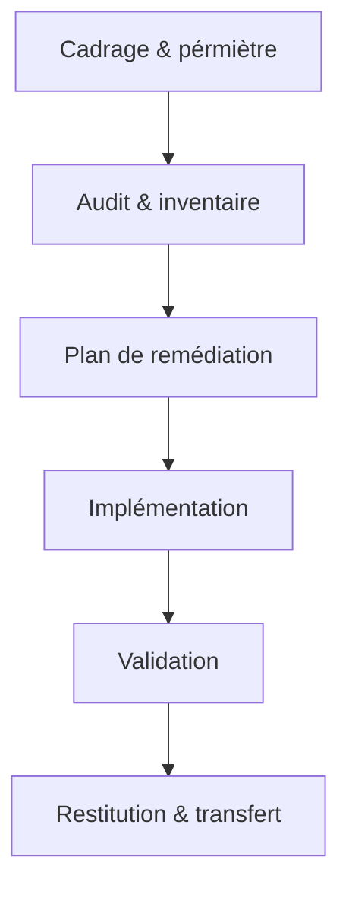

# IT & Cybersécurité externalisée — TPE / PME

**Infrastructures stables, sécurisées, documentées.**
Un prestataire unique pour votre socle technique : de l'audit initial à l'exploitation quotidienne, chaque intervention est tracée, testée et livrée avec sa documentation.

---

## Trois offres clés en main

### [[offres/socle-si-securise|Bundle A — Socle SI sécurisé]]
Remise à niveau complète : segmentation réseau, durcissement, sauvegardes testées, supervision minimale.
Résultat : un SI fonctionnel, documenté, avec des preuves de restauration.

### [[offres/ad-durci|Bundle B — Active Directory durci]]
Séparation des privilèges, bastion admin, réduction des chemins d'attaque, journalisation.
Résultat : un AD maîtrisé, auditable, avec des comptes dédiés et des contrôles mesurables.

### [[offres/plateforme-proxmox-docker|Bundle C — Plateforme Proxmox & Docker]]
Virtualisation stable, conteneurisation industrialisée, SSO, reverse proxy TLS, exploitation documentée.
Résultat : une plateforme prête pour la production, avec rollback et supervision intégrés.

> **[[offres|Voir toutes les offres et le comparatif →]]**

---

## Preuves sélectionnées

| Bundle | Preuve                                                                                                  | Résumé                                                                      |
| ------ | ------------------------------------------------------------------------------------------------------- | --------------------------------------------------------------------------- |
| A      | [[preuves/preuve-a1-socle-si-lab\|Socle SI — lab complet]] | Segmentation + MFA + sauvegardes testées + monitoring sur environnement lab |
| B      | [[preuves/preuve-b1-ad-tiering-admin-securisee\|AD durci — tiering & admin sécurisée]] | Modèle de rôles, bastion, GPO durcie, LAPS — lab Active Directory |
| C      | [[preuves/preuve-c2-docker-portainer-ldap-sso\|Docker industrialisé — SSO & reverse proxy]] | Traefik TLS + Portainer + Authentik/LDAP — lab conteneurs |

> **[[preuves|Toutes les preuves →]]**

---

## Ressources pour comprendre

- [[ressources/why-socle-securise-pme|Pourquoi un socle SI sécurisé est vital pour une PME]]
- [[ressources/backup-3-2-1-pourquoi-ca-sauve|La règle 3-2-1 des sauvegardes, expliquée simplement]]
- [[ressources/docker-en-prod-les-7-regles|Docker en production : les 7 règles à respecter]]

> **[[ressources|Tous les articles →]]**

---

## Comment je travaille — process en 6 étapes

1. **Cadrage & périmètre** — Définition des objectifs, contraintes, exclusions.
2. **Audit rapide & inventaire** — État des lieux technique, cartographie des risques prioritaires.
3. **Plan de remédiation** — Actions priorisées, estimations, dépendances.
4. **Implémentation** — Fenêtres de maintenance, rollback systématique, tests unitaires.
5. **Validation** — Tests fonctionnels, preuves de conformité, KPIs mesurés.
6. **Restitution & transfert** — Documentation, runbooks, transfert de compétences, backlog résiduel.

> **[[methodes/process-6-etapes|Détail du process →]]**

---

## Ce que vous obtenez toujours

> Quelle que soit l'offre choisie, chaque mission inclut :
>
> - **Documentation complète** — architecture, procédures, décisions.
> - **Runbooks opérationnels** — actions pas-à-pas pour votre équipe.
> - **Backlog de remédiation** — ce qui reste à faire, priorisé.
> - **Transfert de compétences** — vos admins sont autonomes après la mission.
> - **Preuves anonymisées** — chaque contrôle est vérifiable.

---

## Contact

Vous avez un besoin en infrastructure, sécurité ou exploitation ?

**Étape 1** — Décrivez votre contexte en quelques lignes (taille, SI existant, urgence).
**Étape 2** — Je vous propose un cadrage gratuit de 30 minutes.
**Étape 3** — Vous recevez une proposition claire avec périmètre, livrables et planning.

> 📬 *Formulaire de contact ou prise de rendez-vous à venir — en attendant, utilisez les coordonnées disponibles sur la page [[à-propos/contact|Contact]].*

---

[[à-propos|À propos — Profil, valeurs, CV]] · [[methodes|Méthodes & garanties]] · [[offres/faq|FAQ]]