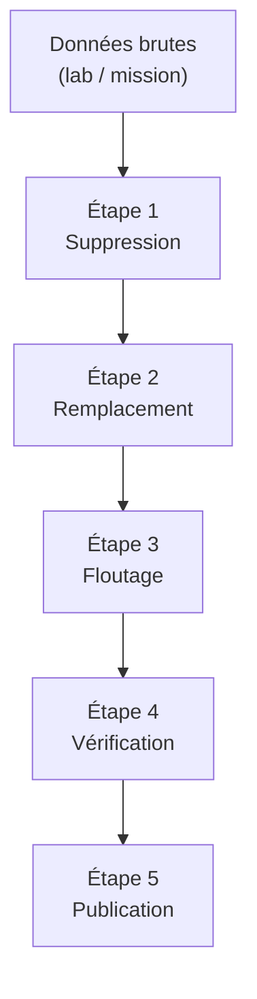

# Anonymisation & publication

**Politique complète : du lab privé à la publication.**

Aucune donnée identifiable n'est publiée. Chaque preuve, schéma ou capture passe par un pipeline d'anonymisation strict avant d'être versé dans la vitrine.

---

## Pipeline "private → publish"



---

## Étape 1 — Suppression

Supprimer toute information qui n'apporte rien à la démonstration :

- [ ] Numéros de série, clés de licence.
- [ ] Adresses email personnelles.
- [ ] Noms réels de personnes.
- [ ] Historiques de commandes contenant des données sensibles.
- [ ] Métadonnées EXIF des images.

---

## Étape 2 — Remplacement (tokens)

Remplacer les éléments identifiables par des tokens génériques :

| Type | Token |
|------|-------|
| Nom de client | `CLIENT-X` |
| Contrôleur de domaine | `DC01`, `DC02` |
| Serveur applicatif | `APP01`, `APP02` |
| Réseau LAN | `LAN-A`, `LAN-B` |
| DMZ | `DMZ` |
| VPN | `VPN` |
| Domaine interne | `corp.local` |
| Domaine externe | `example.com` |
| IP internes | `10.0.X.Y` (renumérotées) |
| IP publiques | `198.51.100.X` (RFC 5737) |
| Utilisateurs | `user-01`, `admin-t1`, `svc-app01` |

**Règle** : un même élément réel garde le même token dans toute la preuve (cohérence).

---

## Étape 3 — Floutage (captures)

Pour chaque capture d'écran :

- [ ] Flouter les barres de titre (noms de fenêtre, chemins, URLs).
- [ ] Flouter les identifiants visibles (SID, GUID, noms d'objets AD spécifiques).
- [ ] Flouter les numéros de version précis si cela permet d'identifier l'environnement.
- [ ] Ajouter un **cartouche** au-dessus de la capture :

```
┌─────────────────────────────────────────────────┐
│  Capture anonymisée — méthode décrite dans       │
│  /methodes/anonymisation-publication             │
└─────────────────────────────────────────────────┘
```

**Outils suggérés** :
- GIMP / Shotwell (floutage).
- ImageMagick (batch floutage CLI).
- `exiftool -all=` (suppression métadonnées EXIF).

---

## Étape 4 — Vérification

Avant toute publication, vérifier chaque fichier :

- [ ] **Grep inverse** : rechercher dans le fichier les noms réels, IP réelles, domaines réels.
  ```bash
  grep -riE "(nom-réel|domaine-réel|192\.168\.X)" fichier.md
  ```
- [ ] **Vérification visuelle** : ouvrir chaque image et chercher du texte lisible non anonymisé.
- [ ] **Relecture croisée** : si possible, faire relire par une tierce personne.
- [ ] **Métadonnées** : vérifier que les fichiers PNG/PDF ne contiennent pas de métadonnées.
  ```bash
  exiftool image.png
  ```

---

## Étape 5 — Publication

- Le fichier anonymisé est placé dans `annexes/images/` ou dans la page Markdown.
- Le nommage respecte la convention : `A1_schema.png`, `B1_laps_proof.png`, etc.
- Le commit ne doit pas contenir de fichiers bruts dans l'historique Git.

**Recommandation** : travailler dans une branche `draft/`, anonymiser, puis merger dans `main` uniquement les fichiers finaux.

---

## Checklist complète (à copier dans chaque preuve)

```markdown
## Anonymisation appliquée
- [ ] Tokens de remplacement utilisés (voir tableau)
- [ ] Captures floutées + cartouche ajouté
- [ ] Métadonnées EXIF supprimées
- [ ] Grep inverse effectué (aucun résultat)
- [ ] Vérification visuelle effectuée
- [ ] Nommage standard respecté
```

---

## Références

- [[content/methodes/securite-des-donnees|Sécurité des données]]
- [CNIL — Guide de la sécurité des données personnelles](https://www.cnil.fr/fr/guide-de-la-securite-des-donnees-personnelles)
- [Directive NIS2 — contexte](https://www.ssi.gouv.fr/directive-nis-2/) (cadre réglementaire, sans analyse juridique)
