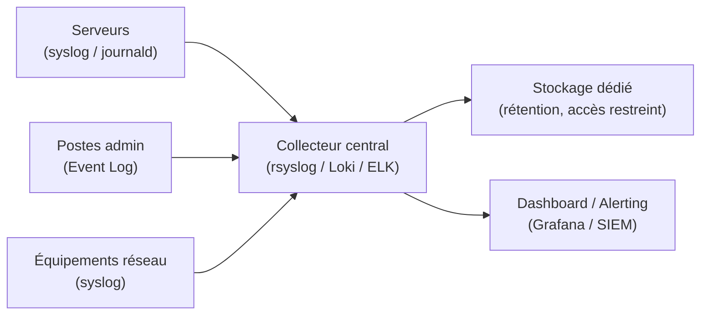

# Journalisation & conformité

**Méthode de journalisation "utile" : quoi logger, pourquoi, combien de temps, dans le respect de la CNIL.**

---

## Principes directeurs

### 1. On ne collecte que ce qui sert

Pas de collecte "au cas où". Chaque type de log doit répondre à un besoin identifié :
- **Sécurité** : détecter les comportements anormaux (échecs d'authentification, élévations de privilèges, accès non autorisés).
- **Exploitation** : diagnostiquer les pannes (erreurs système, saturation ressources, arrêts de service).
- **Conformité** : prouver le respect des règles (accès aux données sensibles, modifications de configuration).

### 2. Minimisation (CNIL)

> *"Les données personnelles doivent être adéquates, pertinentes et limitées à ce qui est nécessaire."* — RGPD, article 5.

- Ne pas logger le contenu des communications.
- Ne pas logger les mots de passe (même hachés dans les logs d'authentification).
- Minimiser les données personnelles dans les logs (identifiants techniques plutôt que noms complets).

### 3. Séparation des rôles

- Les administrateurs système ne doivent pas pouvoir modifier leurs propres logs.
- Les logs de sécurité doivent être stockés sur un système séparé (syslog distant, SIEM, stockage dédié).
- L'accès aux logs est restreint au strict nécessaire.

---

## Quoi logger

| Catégorie | Événements | Exemples |
|-----------|-----------|----------|
| **Authentification** | Succès, échecs, verrouillages | Connexion AD, SSH, VPN |
| **Autorisation** | Élévations de privilèges, changements de groupe | `sudo`, ajout Domain Admins |
| **Modifications** | Changements de configuration, GPO, firewall | Modification règle FW, GPO modifiée |
| **Accès données** | Accès aux fichiers sensibles / bases | Accès partage RH, export base |
| **Système** | Démarrage/arrêt, erreurs critiques, saturation | Reboot serveur, disque plein |
| **Réseau** | Connexions inhabituelles, flux bloqués | Connexion sortante suspecte, drop FW |

---

## Durée de rétention

| Type de log | Durée recommandée | Justification |
|-------------|-------------------|---------------|
| Authentification | 6 mois à 1 an | Détection d'attaques, conformité |
| Système / exploitation | 3 à 6 mois | Diagnostic, tendances |
| Sécurité (alertes) | 1 an minimum | Investigation, preuve |
| Accès données sensibles | 1 an (CNIL) | Conformité RGPD |
| Logs réseau (firewall) | 3 à 6 mois | Analyse de flux |

*Ces durées sont indicatives. Elles doivent être adaptées au contexte réglementaire du client (secteur, taille, obligations).*

---

## Architecture de collecte

---

## Bonnes pratiques

- **Horodatage cohérent** : NTP sur tous les équipements. Les logs sans horodatage fiable sont inutiles.
- **Format structuré** : JSON ou CEF quand possible (plutôt que des logs texte brut).
- **Rotation** : configurer la rotation des logs pour éviter la saturation disque.
- **Chiffrement en transit** : TLS pour les flux syslog réseau.
- **Intégrité** : signature ou hash des fichiers de logs critiques (détection de manipulation).

---

## Références

- [[preuves/preuve-t1-observabilite-siem-lite|Preuve T1 — Observabilité & SIEM-lite]]
- [CNIL — Journalisation](https://www.cnil.fr/fr/la-cnil-publie-une-recommandation-relative-a-la-journalisation)
- [CNIL — Guide de la sécurité des données personnelles](https://www.cnil.fr/fr/guide-de-la-securite-des-donnees-personnelles)
- [ANSSI — Guide d'hygiène informatique](https://www.ssi.gouv.fr/guide/guide-dhygiene-informatique/)
- [[ressources/journalisation-utile-sans-surveiller|Article vulgarisé — Journalisation utile sans surveiller]]
