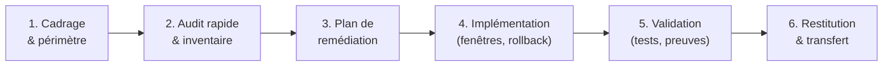

# Process en 6 étapes

Chaque mission suit le même déroulement, quelle que soit l'offre. Ce cadre garantit la traçabilité, la qualité des livrables et la maîtrise des risques.

---

## Vue d'ensemble

---

## Étape 1 — Cadrage & périmètre

**Objectif** : s'aligner sur les attentes, définir ce qui est IN et OUT.

**Actions** :
- Réunion de cadrage (30 min à 1 h) : contexte, objectifs, contraintes, urgences.
- Définition du périmètre : systèmes concernés, exclusions explicites.
- Identification des interlocuteurs et des fenêtres de maintenance.
- Validation des pré-requis (accès, comptes, documentation existante).

**Livrable** : document de cadrage (périmètre, contacts, planning prévisionnel, pré-requis).

---

## Étape 2 — Audit rapide & inventaire

**Objectif** : photographier l'existant, identifier les risques prioritaires.

**Actions** :
- Inventaire technique : serveurs, services, comptes, réseaux, sauvegardes.
- Évaluation rapide de la posture de sécurité (pas un audit complet — un état des lieux).
- Identification des "quick wins" (actions à fort impact, faible effort).
- Notation des écarts par rapport aux référentiels (ANSSI, CIS).

**Livrable** : rapport d'audit rapide (inventaire + écarts + priorités).

---

## Étape 3 — Plan de remédiation

**Objectif** : prioriser les actions et planifier l'exécution.

**Actions** :
- Priorisation des remédiations (criticité × effort × dépendances).
- Estimation des durées par action.
- Identification des dépendances (éditeur, réseau, RH).
- Planification des fenêtres de maintenance.
- Définition des critères de succès (KPIs mesurables).

**Livrable** : backlog de remédiation priorisé + planning d'exécution.

---

## Étape 4 — Implémentation

**Objectif** : exécuter les remédiations dans un cadre maîtrisé.

**Principes** :
- Chaque modification est planifiée et documentée **avant** exécution.
- Rollback systématique : chaque action a un plan de retour arrière.
- Tests unitaires après chaque modification.
- Journalisation des actions (qui, quoi, quand, résultat).
- Communication au client à chaque étape critique.

**Outils** : snapshots, sauvegardes pré-intervention, scripts de rollback, journaux.

---

## Étape 5 — Validation & tests

**Objectif** : prouver que les modifications fonctionnent et atteignent les objectifs.

**Actions** :
- Tests fonctionnels : les services fonctionnent normalement.
- Tests de sécurité : les contrôles sont effectifs (accès restreints, MFA, segmentation).
- Tests de restauration : au moins un test de restore documenté.
- Mesure des KPIs définis à l'étape 3.
- Documentation des résultats (captures anonymisées, journaux).

**Livrable** : rapport de validation (tests + résultats + écarts résiduels).

---

## Étape 6 — Restitution & transfert

**Objectif** : remettre les clés au client, le rendre autonome.

**Actions** :
- Session de restitution (1 à 2 h) : présentation des résultats, démonstration des outils.
- Remise de la documentation complète (schémas, runbooks, procédures).
- Remise du backlog résiduel (ce qui reste à faire, priorisé).
- Transfert de compétences : les admins du client savent exploiter ce qui a été mis en place.
- Période de support post-mission (durée définie au cadrage).

**Livrables** :
- Documentation technique complète.
- Runbooks opérationnels.
- Backlog de remédiation résiduel.
- Compte-rendu de restitution.

---

## Checklist client (pré-requis d'accès)

Avant le démarrage de la mission, le client doit fournir :

- [ ] **Interlocuteur technique** : nom, rôle, disponibilité.
- [ ] **Accès admin** : comptes dédiés (pas de compte partagé), VPN si remote.
- [ ] **Documentation existante** : schémas réseau, inventaire, procédures (même partiels).
- [ ] **Fenêtres de maintenance** : plages horaires validées pour les interventions.
- [ ] **Accord écrit** : validation du périmètre et des exclusions.
- [ ] **Contacts d'urgence** : en cas de problème pendant une intervention.

---

## Références

- [[offres|Toutes les offres]]
- [[methodes/anonymisation-publication|Anonymisation & publication]]
- [[methodes/securite-des-donnees|Sécurité des données]]
- [ANSSI — Guide d'hygiène informatique](https://www.ssi.gouv.fr/guide/guide-dhygiene-informatique/)
