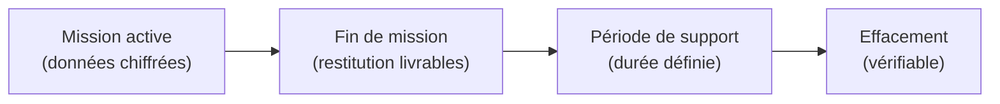

# Sécurité des données

**Garanties sur la protection des données confiées pendant et après chaque mission.**

---

## Principes

1. **Moindre accès** : je n'accède qu'aux données nécessaires à la mission, avec des comptes dédiés et tracés.
2. **Chiffrement** : les données en transit et au repos sont chiffrées.
3. **Séparation** : les données de chaque client sont isolées (aucun mélange, aucun partage).
4. **Rétention limitée** : les données de travail sont conservées uniquement le temps de la mission + période de support.
5. **Effacement** : en fin de mission, les données sont effacées de manière vérifiable.

---

## Secrets & coffre

### Gestion des secrets pendant la mission

| Type de secret | Méthode |
|---------------|---------|
| Mots de passe d'accès | Coffre-fort de mots de passe chiffré (KeePass / Bitwarden) |
| Clés SSH | Générées par mission, supprimées à la fin |
| Tokens / API keys | Stockés dans le coffre, jamais en clair dans les scripts ou docs |
| Certificats | Générés localement, pas de réutilisation entre missions |

### Règles

- **Jamais de secret dans un dépôt Git** (même privé).
- **Jamais de secret dans une capture d'écran**.
- **Rotation** : les secrets temporaires sont modifiés en fin de mission par le client.
- **Partage sécurisé** : si un secret doit être transmis, utilisation d'un canal chiffré (échange de clé dédié, pas d'email en clair).

---

## Chiffrement

| Contexte | Méthode |
|----------|---------|
| Données en transit | TLS 1.2+ (VPN, SSH, HTTPS) |
| Données au repos (stockage local) | Chiffrement disque complet (LUKS / BitLocker) |
| Sauvegardes de travail | Chiffrées (AES-256) |
| Échanges de fichiers | Chiffrement de bout en bout (GPG / age) |

---

## Rétention & effacement

### Cycle de vie des données de mission

### Durées

| Type de donnée | Rétention | Effacement |
|---------------|-----------|------------|
| Données brutes de travail | Durée de la mission | Effacement en fin de mission |
| Livrables finaux | Remis au client | Copie locale effacée après période de support |
| Données de sauvegarde temporaire | 30 jours max après mission | Effacement + vérification |
| Logs d'accès (mes propres logs) | 6 mois | Effacement automatique par rotation |

### Méthode d'effacement

- **Fichiers** : suppression sécurisée (`shred` / `srm` ou équivalent).
- **VMs de travail** : destruction de la VM + effacement du stockage associé.
- **Dépôts Git privés** : suppression du dépôt (pas de simple `rm` — suppression côté serveur).
- **Certificat d'effacement** : sur demande, un attestation écrite de suppression des données.

---

## Engagement

> Je ne conserve aucune donnée client au-delà de la période définie.
> Je ne réutilise aucune donnée d'un client pour un autre.
> Je ne publie aucune donnée identifiable — voir [politique d'anonymisation](/methodes/anonymisation-publication).

---

## Références

- [Anonymisation & publication](/methodes/anonymisation-publication)
- [CNIL — Guide de la sécurité des données personnelles](https://www.cnil.fr/fr/guide-de-la-securite-des-donnees-personnelles)
- [ANSSI — Guide d'hygiène informatique](https://www.ssi.gouv.fr/guide/guide-dhygiene-informatique/)
- [Directive NIS2 — contexte](https://www.ssi.gouv.fr/directive-nis-2/)
