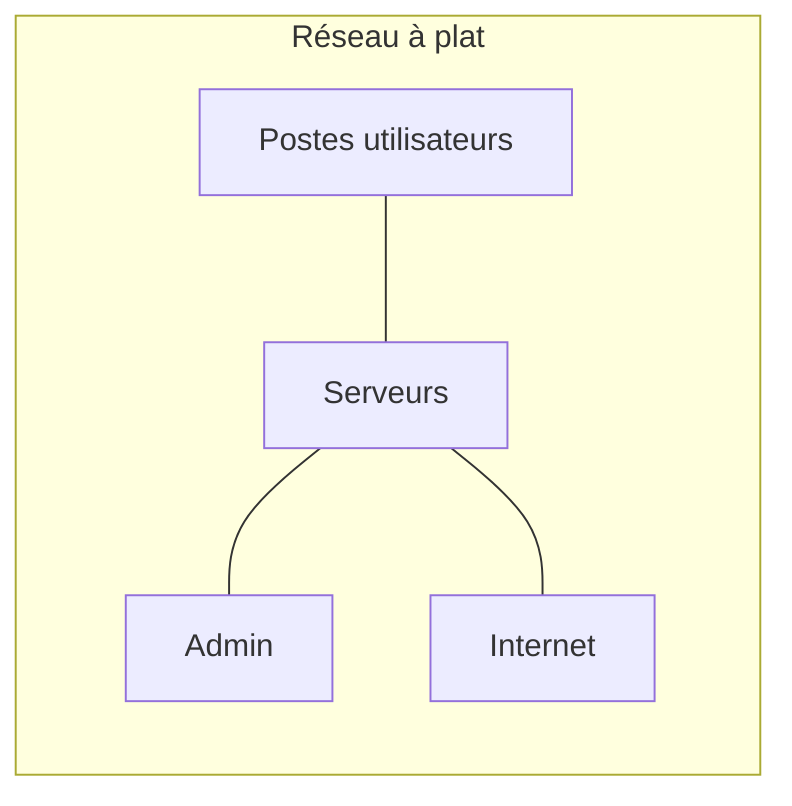
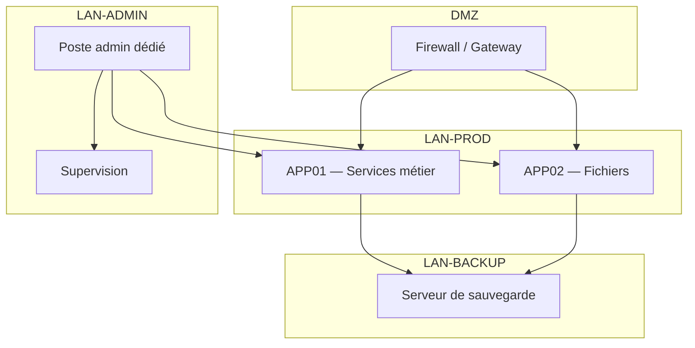

# Preuve A1 — Remise à niveau SI PME : segmentation + MFA + sauvegardes testées + monitoring

> **Résumé exécutif (1 min)** : Un SI de type PME (lab) sans segmentation, sans MFA, avec des sauvegardes non testées et aucune supervision. En 5 jours lab, le réseau est segmenté en 3 zones, le MFA est activé sur les accès admin, les sauvegardes suivent la règle 3-2-1 avec un test de restauration réussi en moins de 30 minutes, et un monitoring couvre les 5 services critiques. Le backlog résiduel est documenté et priorisé.

---

## Contexte

- **Type de structure** : PME type (20-50 postes, 3-5 serveurs, 1 site).
- **Problème initial** : réseau à plat (un seul VLAN), comptes admin partagés, sauvegardes "supposées fonctionnelles" mais jamais testées, aucune supervision.
- **Objectifs mesurables** :
  - Segmenter le réseau en 3 zones minimum (admin, prod, backup).
  - Activer MFA sur 100 % des accès d'administration.
  - Atteindre un RPO de 4 h et un RTO de 30 min pour les services critiques.
  - Couvrir 100 % des services critiques par la supervision.

---

## Architecture

### Avant

### Après

---

## Méthode

1. **Inventaire** : cartographie des serveurs, services, flux réseau existants.
2. **Conception réseau** : définition des zones (prod, admin, backup) et des règles de filtrage.
3. **Déploiement firewall** : mise en place du firewall (OPNsense ou équivalent) avec règles par flux.
4. **Segmentation** : migration des VMs dans les bons VLAN, tests de connectivité.
5. **MFA** : activation du MFA sur les accès admin (VPN, console Proxmox, SSH).
6. **Sauvegardes** : configuration PBS (ou équivalent), politique 3-2-1, planification.
7. **Test de restauration** : restauration complète d'une VM sur un réseau isolé.
8. **Supervision** : déploiement Zabbix/Prometheus, alertes sur les services critiques.
9. **Documentation** : schéma réseau, runbooks, backlog.

> Méthode complète : [[content/methodes/process-6-etapes|Process en 6 étapes]]

---

## Contrôles appliqués

| Contrôle | Référence | Statut |
|----------|-----------|--------|
| Segmentation réseau (zones dédiées) | ANSSI Hygiène — R12, R13 | ✅ Appliqué |
| Comptes d'administration dédiés | ANSSI Admin sécurisée — R1, R2 | ✅ Appliqué |
| MFA sur accès admin | ANSSI Hygiène — R19 | ✅ Appliqué |
| Sauvegarde 3-2-1 | ANSSI Hygiène — R36, R37 | ✅ Appliqué |
| Test de restauration documenté | ANSSI Hygiène — R37 | ✅ Appliqué |
| Supervision des services critiques | ANSSI Hygiène — R33 | ✅ Appliqué |
| Journalisation des accès | CNIL — Journalisation | ✅ Activé |

---

## Résultats / KPIs

| KPI | Avant | Après | Objectif |
|-----|-------|-------|----------|
| Zones réseau segmentées | 1 (réseau à plat) | 3 (prod, admin, backup) | ≥ 3 |
| Comptes admin avec MFA | 0 % | 100 % | 100 % |
| Services critiques supervisés | 0 / 5 | 5 / 5 | 5 / 5 |
| RPO (services critiques) | Inconnu | 4 h | ≤ 4 h |
| RTO (mesuré sur test restore) | Jamais testé | 25 min | ≤ 30 min |
| Couverture sauvegarde | ~60 % (partiel, non vérifié) | 100 % | 100 % |

*Valeurs issues d'un environnement lab — exemple lab.*

---

## Backlog de remédiation (extrait)

| # | Action | Priorité | Statut |
|---|--------|----------|--------|
| 1 | Segmentation réseau (3 zones) | Haute | ✅ Fait |
| 2 | MFA sur accès admin | Haute | ✅ Fait |
| 3 | Politique de sauvegarde 3-2-1 | Haute | ✅ Fait |
| 4 | Test de restauration | Haute | ✅ Fait |
| 5 | Supervision des services critiques | Haute | ✅ Fait |
| 6 | Durcissement SSH (clés uniquement, fail2ban) | Moyenne | ✅ Fait |
| 7 | Politique de mots de passe (complexité, expiration) | Moyenne | ⏳ Planifié |
| 8 | Chiffrement des sauvegardes hors site | Moyenne | ⏳ Planifié |
| 9 | Scan de vulnérabilités régulier | Basse | 📋 Backlog |
| 10 | Formation admin (runbooks, procédures) | Basse | 📋 Backlog |

---

## Runbooks (extraits)

### Runbook : Test de restauration VM

1. **Pré-requis** : accès PBS, réseau isolé de test disponible.
2. **Étapes** :
   1. Identifier la VM à restaurer et le point de sauvegarde.
   2. Lancer la restauration sur le réseau isolé (pas sur le réseau de production).
   3. Vérifier le démarrage de la VM.
   4. Tester la connectivité réseau et le service applicatif.
   5. Mesurer le temps total (début restore → service opérationnel).
3. **Vérification** : le service répond correctement, les données sont intègres (checksum ou test applicatif).
4. **Rollback** : supprimer la VM de test après validation.
5. **Journal** : consigner date, durée, résultat, écarts dans le journal de test.

### Runbook : Ajout d'une règle firewall

1. **Pré-requis** : accès admin au firewall, documentation des flux existants.
2. **Étapes** :
   1. Documenter la règle à ajouter (source, destination, port, protocole, justification).
   2. Ajouter la règle en mode "log only" (si possible) pour valider le trafic.
   3. Activer la règle après validation.
   4. Tester la connectivité impactée.
3. **Vérification** : le flux fonctionne, aucun flux non prévu n'est ouvert.
4. **Rollback** : supprimer la règle ajoutée.

---

## Tâches LAB (à réaliser sur Proxmox)

- [ ] Créer un lab isolé avec 3 réseaux (VLAN ou bridges) : prod, admin, backup.
- [ ] Déployer un firewall (OPNsense ou pfSense) reliant les 3 zones — ne pas publier la configuration.
- [ ] Déployer une VM "poste admin" sur le réseau admin.
- [ ] Déployer 1-2 VM "serveurs services" sur le réseau prod.
- [ ] Configurer le MFA sur l'accès admin (VPN ou console).
- [ ] Activer les sauvegardes (PBS ou équivalent) sur le réseau backup + planification.
- [ ] Exécuter un test de restauration complet + consigner le journal.
- [ ] Déployer la supervision (Zabbix ou Prometheus + Grafana) sur le réseau admin.
- [ ] Configurer les alertes sur les 5 services critiques identifiés.

---

## Captures à produire (à anonymiser)

- [ ] **Topologie Proxmox** : vue des VMs et réseaux (floutée) → `A1_schema.png`
- [ ] **Tableau backups** : preuve de planification + preuve de restore réussi → `A1_backup_restore.png`
- [ ] **Dashboard monitoring** : vue Grafana/Zabbix avec les 5 services (floutée) → `A1_monitoring_dashboard.png`

Emplacements prévus :
- `../annexes/images/TODO_A1_schema.png`
- `../annexes/images/TODO_A1_backup_restore.png`
- `../annexes/images/TODO_A1_monitoring_dashboard.png`

---

## Anonymisation appliquée

- [ ] Tokens de remplacement utilisés (voir [[content/methodes/anonymisation-publication|tableau]])
- [ ] Captures floutées + cartouche ajouté
- [ ] Métadonnées EXIF supprimées
- [ ] Grep inverse effectué (aucun résultat)
- [ ] Vérification visuelle effectuée
- [ ] Nommage standard respecté

---

## Références

- **Offre** : [[content/offres/socle-si-securise|Bundle A — Socle SI sécurisé]]
- **Méthode** : [[content/methodes/process-6-etapes|Process en 6 étapes]]
- **Méthode** : [[content/methodes/restauration-backup-pra|Restauration, backup & PRA/PCA]]
- **Article** : [[content/ressources/why-socle-securise-pme|Pourquoi un socle SI sécurisé est vital pour une PME]]
- **ANSSI** : [Guide d'hygiène informatique](https://www.ssi.gouv.fr/guide/guide-dhygiene-informatique/)
- **ANSSI** : [Administration sécurisée des SI](https://www.ssi.gouv.fr/guide/recommandations-relatives-a-ladministration-securisee-des-systemes-dinformation/)

---

## À faire (humain)

- [ ] Exécuter les tâches LAB (section "Tâches LAB" ci-dessus)
- [ ] Produire les captures (section "Captures à produire" ci-dessus)
- [ ] Anonymiser (checklist "Anonymisation appliquée" ci-dessus)
- [ ] Ajouter les images dans `annexes/images/`
- [ ] Vérifier les liens internes
- [ ] Relire "Résumé exécutif"
