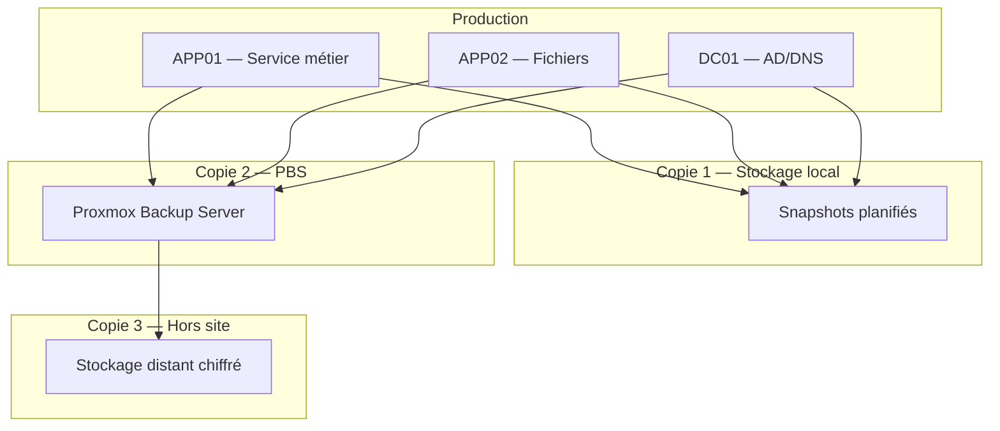

# Preuve A2 — PRA/PCA minimal : RPO/RTO + 3-2-1 + exercices de restauration

> **Résumé exécutif (1 min)** : Un environnement PME lab sans plan de reprise formalisé. Après cadrage, la stratégie 3-2-1 est implémentée avec des RPO/RTO définis par service. Trois scénarios de sinistre sont testés (panne stockage, erreur admin, ransomware conceptuel). Le test de restauration complet est réussi en 22 minutes, documenté dans un journal de preuve. Le PRA minimal est livré avec runbooks et planning d'exercices trimestriels.

---

## Contexte

- **Type de structure** : PME type (lab Proxmox simulant 3-5 services critiques).
- **Problème initial** : sauvegardes "en place" mais jamais testées, aucun RPO/RTO défini, pas de procédure de reprise.
- **Objectifs mesurables** :
  - Définir RPO/RTO pour chaque service critique.
  - Implémenter la stratégie 3-2-1.
  - Réaliser au moins 3 tests de restauration documentés.
  - Documenter un PRA minimal exploitable.

---

## Architecture de sauvegarde

---

## Matrice RPO/RTO

| Service | RPO | RTO | Stratégie | Fréquence backup |
|---------|-----|-----|-----------|------------------|
| DC01 — AD/DNS | 4 h | 1 h | Snapshot + PBS quotidien | Toutes les 4 h |
| APP01 — Service métier | 4 h | 30 min | Snapshot + PBS quotidien | Toutes les 4 h |
| APP02 — Fichiers | 1 h | 2 h | Snapshot horaire + PBS | Toutes les heures |

*Valeurs lab — à adapter au contexte réel du client.*

---

## Scénarios testés

### Scénario 1 — Panne stockage

- **Simulation** : désactivation du stockage principal d'une VM.
- **Réponse** : restauration depuis PBS sur stockage alternatif.
- **Résultat** : VM opérationnelle en 18 minutes.
- **Journal** : consigné (voir section journal ci-dessous).

### Scénario 2 — Erreur d'administration

- **Simulation** : suppression accidentelle d'une VM.
- **Réponse** : restauration depuis le dernier snapshot.
- **Résultat** : VM restaurée en 8 minutes (snapshot récent).
- **Journal** : consigné.

### Scénario 3 — Ransomware (niveau conceptuel)

- **Simulation conceptuelle** : les VMs de production sont considérées comme compromises.
- **Réponse** : isolation réseau, restauration depuis backup hors ligne (PBS sur réseau backup isolé).
- **Résultat** : restauration complète (3 VMs) en 45 minutes sur réseau isolé.
- **Note** : aucun ransomware réel n'est utilisé. Le scénario teste la procédure de reprise, pas l'attaque.

---

## Journal de test de restauration (extrait)

| Date | Service restauré | Type backup | Support | Durée | Résultat | Écarts |
|------|-----------------|-------------|---------|-------|----------|--------|
| 2025-XX-XX | APP01 | Snapshot | Proxmox local | 8 min | ✅ Succès | Aucun |
| 2025-XX-XX | APP01 | Backup complet | PBS | 18 min | ✅ Succès | Aucun |
| 2025-XX-XX | APP02 | Backup complet | PBS | 22 min | ✅ Succès | Aucun |
| 2025-XX-XX | 3 VMs | Backup complet | PBS (isolé) | 45 min | ✅ Succès | Ordre de démarrage à documenter |

*Dates anonymisées — environnement lab.*

---

## Méthode de test

1. **Planification** : choisir le service, le point de sauvegarde, le réseau de test.
2. **Isolation** : restaurer sur un réseau isolé (pas en production).
3. **Restauration** : lancer le restore, chronométrer.
4. **Vérification** : démarrage VM, connectivité réseau, service applicatif fonctionnel.
5. **Journal** : consigner tous les détails (durée, résultat, écarts, actions correctives).
6. **Nettoyage** : supprimer la VM de test.

---

## Contrôles appliqués

| Contrôle | Référence | Statut |
|----------|-----------|--------|
| Stratégie 3-2-1 | ANSSI Hygiène — R36, R37 | ✅ Appliqué |
| RPO/RTO définis par service | Bonne pratique PRA | ✅ Appliqué |
| Test de restauration documenté | ANSSI Hygiène — R37 | ✅ Appliqué |
| Backup isolé du réseau de production | ANSSI — séparation réseau | ✅ Appliqué |
| Journalisation des tests | CNIL — traçabilité | ✅ Appliqué |

---

## Résultats / KPIs

| KPI | Avant | Après | Objectif |
|-----|-------|-------|----------|
| RPO défini | Non | Oui (par service) | ✅ |
| RTO mesuré | Jamais testé | 8-45 min selon scénario | ≤ objectif par service |
| Tests de restauration documentés | 0 | 4 | ≥ 3 |
| Couverture sauvegarde 3-2-1 | Partielle | 100 % services critiques | 100 % |

*Valeurs issues d'un environnement lab — exemple lab.*

---

## Backlog de remédiation (extrait)

| # | Action | Priorité | Statut |
|---|--------|----------|--------|
| 1 | Définir RPO/RTO par service | Haute | ✅ Fait |
| 2 | Implémenter 3-2-1 (PBS + hors site) | Haute | ✅ Fait |
| 3 | Tester 3 scénarios de restauration | Haute | ✅ Fait |
| 4 | Documenter le PRA minimal | Haute | ✅ Fait |
| 5 | Automatiser les tests de restore (script) | Moyenne | ⏳ Planifié |
| 6 | Planifier exercices trimestriels | Moyenne | ⏳ Planifié |
| 7 | Chiffrer les sauvegardes hors site | Moyenne | 📋 Backlog |
| 8 | Tester la reprise complète (toutes VMs) en conditions réelles | Basse | 📋 Backlog |

---

## Runbooks (extraits)

### Runbook : Exercice de restauration trimestriel

1. **Planification** : choisir 1 service critique au hasard, notifier les parties prenantes.
2. **Exécution** : suivre la procédure de test (isolation, restore, vérification, journal).
3. **Analyse** : comparer la durée au RTO cible. Identifier les écarts.
4. **Actions correctives** : si RTO dépassé, identifier la cause et planifier la correction.
5. **Archivage** : ajouter le journal au dossier PRA.

---

## Tâches LAB (à réaliser sur Proxmox)

- [ ] Mettre en place PBS (Proxmox Backup Server) sur un réseau dédié backup.
- [ ] Configurer la planification des sauvegardes (snapshot + PBS) pour 3 VMs.
- [ ] Configurer la rétention (ex : 7 quotidiens, 4 hebdomadaires, 3 mensuels).
- [ ] Exécuter un exercice de restauration pour chaque scénario (panne, erreur, "ransomware").
- [ ] Consigner les résultats dans le journal de test.
- [ ] Documenter la procédure de reprise (PRA minimal).

---

## Captures à produire (à anonymiser)

- [ ] **Planning backup** : vue PBS montrant la planification (floutée) → `A2_backup_planning.png`
- [ ] **Log restore test** : journal d'un test de restauration (anonymisé) → `A2_restore_log.png`
- [ ] **Tableau RPO/RTO** : matrice complétée (peut être en Markdown, pas de capture nécessaire).

Emplacements prévus :
- `../annexes/images/TODO_A2_backup_planning.png`
- `../annexes/images/TODO_A2_restore_log.png`

---

## Anonymisation appliquée

- [ ] Tokens de remplacement utilisés (voir [[methodes/anonymisation-publication|tableau]])
- [ ] Captures floutées + cartouche ajouté
- [ ] Métadonnées EXIF supprimées
- [ ] Grep inverse effectué (aucun résultat)
- [ ] Vérification visuelle effectuée
- [ ] Nommage standard respecté

---

## Références

- **Offre** : [[offres/socle-si-securise|Bundle A — Socle SI sécurisé]]
- **Méthode** : [[methodes/restauration-backup-pra|Restauration, backup & PRA/PCA]]
- **Méthode** : [[methodes/process-6-etapes|Process en 6 étapes]]
- **Article** : [[ressources/backup-3-2-1-pourquoi-ca-sauve|La règle 3-2-1 des sauvegardes]]
- **Article** : [[ressources/rpo-rto-explique-sans-jargon|RPO/RTO expliqué sans jargon]]
- **ANSSI** : [Guide d'hygiène informatique](https://www.ssi.gouv.fr/guide/guide-dhygiene-informatique/)

---

## À faire (humain)

- [ ] Exécuter les tâches LAB (section "Tâches LAB" ci-dessus)
- [ ] Produire les captures (section "Captures à produire" ci-dessus)
- [ ] Anonymiser (checklist "Anonymisation appliquée" ci-dessus)
- [ ] Ajouter les images dans `annexes/images/`
- [ ] Vérifier les liens internes
- [ ] Relire "Résumé exécutif"
