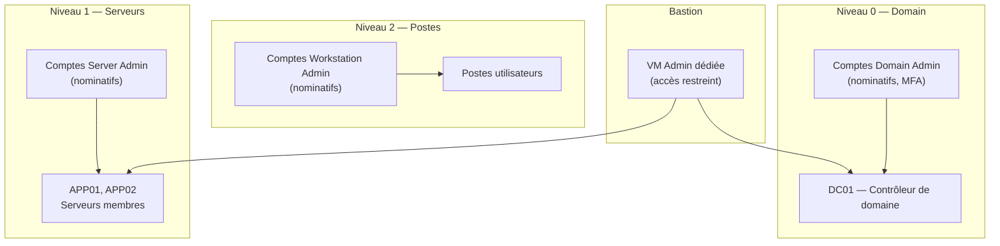
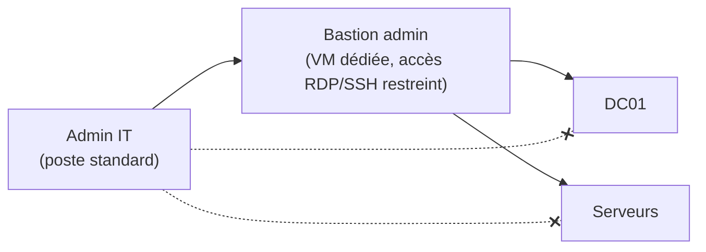

# Preuve B1 — AD durci : séparation des privilèges + bastion admin + réduction des chemins d'attaque

> **Résumé exécutif (1 min)** : Un Active Directory lab simulant une PME typique : tous les admins utilisent le même compte, aucune séparation de privilèges, GPO par défaut, mots de passe locaux identiques partout. Après intervention, un modèle de rôles à 3 niveaux est en place, un bastion admin dédié est déployé, les GPO sont durcies (baseline sécurité), LAPS assure la rotation des mots de passe locaux sur 100 % des machines, et les événements critiques sont journalisés. Le backlog résiduel est documenté.

---

## Contexte

- **Type de structure** : PME type (1 DC, 2 serveurs membres, 5-10 postes simulés, lab Proxmox).
- **Problème initial** : compte "Administrateur" du domaine utilisé par tous les IT, aucun tiering, GPO par défaut, LAPS non déployé, journalisation minimale.
- **Objectifs mesurables** :
  - 0 compte d'administration partagé.
  - Modèle de rôles à 3 niveaux opérationnel.
  - LAPS déployé sur 100 % des machines.
  - Baseline GPO durcie appliquée.
  - Journalisation des événements critiques activée.

---

## Architecture

### Modèle de rôles (tiering simplifié PME)

### Principe du bastion

*L'admin ne se connecte jamais directement aux serveurs depuis son poste standard. Il passe par le bastion.*

---

## Méthode

1. **Audit AD** : inventaire des comptes, groupes, GPO, OU, services dépendants.
2. **Conception du modèle de rôles** : 3 niveaux, comptes nominatifs, séparation des privilèges.
3. **Restructuration OU/groupes** : création des OU par niveau, déplacement des objets.
4. **Création des comptes dédiés** : 1 compte par admin par niveau (convention de nommage stricte).
5. **Déploiement bastion** : VM admin dédiée, accès restreint (firewall + GPO).
6. **Durcissement GPO** : password policy, verrouillage, restrictions d'exécution, audit avancé.
7. **Déploiement LAPS** : installation, configuration, vérification rotation.
8. **Journalisation** : activation des événements d'audit avancés (4624, 4625, 4672, 4728, 4732...).
9. **Documentation** : schéma OU, matrice de droits, runbooks, backlog.

> Méthode complète : [[methodes/process-6-etapes|Process en 6 étapes]]

---

## Contrôles appliqués

| Contrôle | Référence | Statut |
|----------|-----------|--------|
| Comptes d'admin nominatifs par niveau | ANSSI Admin sécurisée — R1, R2, R3 | ✅ Appliqué |
| Bastion d'administration dédié | ANSSI Admin sécurisée — R8 | ✅ Appliqué |
| Séparation des niveaux (tiering) | ANSSI Admin sécurisée — R5 | ✅ Appliqué |
| GPO durcies (password, verrouillage, exécution) | ANSSI AD — recommandations GPO | ✅ Appliqué |
| LAPS déployé sur toutes les machines | ANSSI — rotation mots de passe locaux | ✅ Appliqué |
| Journalisation avancée (4624, 4625, 4672…) | ANSSI — journalisation AD | ✅ Activé |
| Pas de compte "Administrateur" du domaine utilisé au quotidien | ANSSI Admin sécurisée — R1 | ✅ Appliqué |

---

## Résultats / KPIs

| KPI | Avant | Après | Objectif |
|-----|-------|-------|----------|
| Comptes admin partagés | 1 (utilisé par tous) | 0 | 0 |
| Comptes nominatifs par niveau | 0 | 6 (2 admins × 3 niveaux) | Selon effectif IT |
| LAPS déployé | 0 % | 100 % | 100 % |
| GPO durcies appliquées | 0 | 5 (baseline sécurité) | ≥ 5 |
| Événements critiques journalisés | Non | Oui (6 catégories) | ✅ |
| Accès admin via bastion uniquement | Non | Oui | ✅ |

*Valeurs issues d'un environnement lab — exemple lab.*

---

## Backlog de remédiation (extrait)

| # | Action | Priorité | Statut |
|---|--------|----------|--------|
| 1 | Supprimer l'utilisation du compte "Administrateur" partagé | Haute | ✅ Fait |
| 2 | Créer les comptes nominatifs (3 niveaux) | Haute | ✅ Fait |
| 3 | Déployer le bastion admin | Haute | ✅ Fait |
| 4 | Appliquer la baseline GPO | Haute | ✅ Fait |
| 5 | Déployer LAPS | Haute | ✅ Fait |
| 6 | Activer la journalisation avancée | Haute | ✅ Fait |
| 7 | Restreindre les groupes privilégiés (Administrators, Domain Admins) | Moyenne | ⏳ Planifié |
| 8 | Activer la protection contre le credential theft (Credential Guard, si compatible) | Moyenne | 📋 Backlog |
| 9 | MFA sur le bastion (si lab le permet) | Moyenne | 📋 Backlog |
| 10 | Audit AD récurrent (trimestriel) | Basse | 📋 Backlog |

---

## Runbooks (extraits)

### Runbook : Création d'un compte admin nominatif

1. **Pré-requis** : accès Domain Admin via bastion.
2. **Étapes** :
   1. Se connecter au bastion.
   2. Ouvrir la console AD (RSAT).
   3. Créer le compte dans l'OU du niveau correspondant (ex : `OU=T1-Admins,OU=Admin,DC=corp,DC=local`).
   4. Ajouter au groupe de sécurité du niveau (ex : `GS-T1-ServerAdmins`).
   5. Définir un mot de passe initial complexe (à changer à la première connexion).
   6. Documenter dans la matrice de droits.
3. **Vérification** : le compte peut se connecter au bastion et aux serveurs de son niveau, mais pas aux autres niveaux.
4. **Rollback** : désactiver le compte.

### Runbook : Vérification LAPS

1. **Pré-requis** : accès au bastion, droits de lecture LAPS.
2. **Étapes** :
   1. Ouvrir l'outil LAPS UI ou PowerShell.
   2. Vérifier que chaque machine a un mot de passe LAPS attribué.
   3. Vérifier la date d'expiration (rotation effective).
3. **Vérification** : 100 % des machines ont un mot de passe LAPS unique, avec une date d'expiration future.

---

## Tâches LAB (à réaliser sur Proxmox)

- [ ] Déployer Windows Server (DC01) + promouvoir en contrôleur de domaine.
- [ ] Déployer 1-2 serveurs membres (APP01, APP02) + les joindre au domaine.
- [ ] Déployer 1-2 postes Windows (simulés) + les joindre au domaine.
- [ ] Structurer les OU (Admin/T0, Admin/T1, Admin/T2, Utilisateurs, Serveurs, Postes).
- [ ] Créer les groupes de sécurité par niveau.
- [ ] Créer les comptes nominatifs (conventions de nommage décrites).
- [ ] Déployer une VM bastion (accès restreint par firewall).
- [ ] Appliquer la baseline GPO (décrite, pas exportée).
- [ ] Déployer LAPS (installation du client + configuration AD).
- [ ] Activer la journalisation avancée (GPO d'audit).

---

## Captures à produire (à anonymiser)

- [ ] **Schéma OU** : reconstitué en image ou texte (pas de capture brute AD) → `B1_ou_schema.png`
- [ ] **Preuve LAPS** : capture montrant un mot de passe LAPS attribué (flouté) → `B1_laps_proof.png`
- [ ] **Preuve bastion** : capture montrant l'accès via bastion uniquement (flouté) → `B1_bastion_access.png`

Emplacements prévus :
- `../annexes/images/TODO_B1_ou_schema.png`
- `../annexes/images/TODO_B1_laps_proof.png`
- `../annexes/images/TODO_B1_bastion_access.png`

---

## Anonymisation appliquée

- [ ] Tokens de remplacement utilisés (voir [[methodes/anonymisation-publication|tableau]])
- [ ] Captures floutées + cartouche ajouté
- [ ] Métadonnées EXIF supprimées
- [ ] Grep inverse effectué (aucun résultat)
- [ ] Vérification visuelle effectuée
- [ ] Nommage standard respecté

---

## Références

- **Offre** : [[offres/ad-durci|Bundle B — Active Directory durci]]
- **Méthode** : [[methodes/process-6-etapes|Process en 6 étapes]]
- **Article** : [[ressources/ad-pme-pourquoi-cest-la-cible-1|AD en PME : pourquoi c'est la cible nº1]]
- **ANSSI** : [Recommandations pour l'administration sécurisée des SI](https://www.ssi.gouv.fr/guide/recommandations-relatives-a-ladministration-securisee-des-systemes-dinformation/)
- **ANSSI** : [Points de contrôle AD](https://www.cert.ssi.gouv.fr/dur/CERTFR-2020-DUR-001/)

---

## À faire (humain)

- [ ] Exécuter les tâches LAB (section "Tâches LAB" ci-dessus)
- [ ] Produire les captures (section "Captures à produire" ci-dessus)
- [ ] Anonymiser (checklist "Anonymisation appliquée" ci-dessus)
- [ ] Ajouter les images dans `annexes/images/`
- [ ] Vérifier les liens internes
- [ ] Relire "Résumé exécutif"
