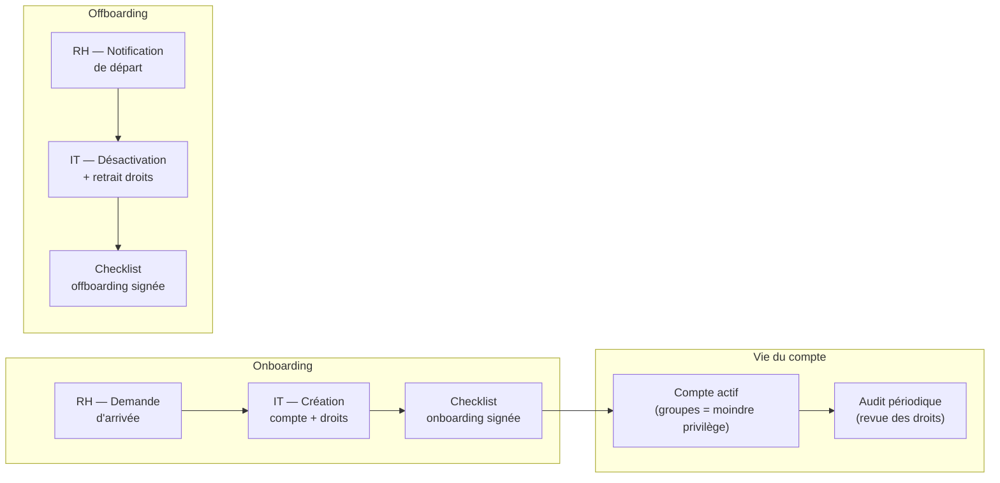

# Preuve B2 — IAM pragmatique : onboarding/offboarding, moindre privilège, traçabilité

> **Résumé exécutif (1 min)** : Dans un lab AD simulant une PME, les arrivées et départs de collaborateurs ne suivent aucune procédure : comptes créés "à la volée", droits copiés d'un collègue, comptes d'anciens salariés encore actifs. Après intervention, des procédures formalisées (checklists RH/IT) encadrent chaque arrivée et chaque départ. Le moindre privilège est appliqué via des groupes de sécurité documentés. La journalisation minimale permet un audit des accès. Résultat lab : 100 % des départs simulés traités en moins de 24 h, zéro compte orphelin.

---

## Contexte

- **Type de structure** : PME type (lab AD, 10-30 comptes simulés).
- **Problème initial** : aucune procédure d'arrivée/départ formalisée, droits attribués par copie, comptes d'anciens collaborateurs encore actifs, aucune traçabilité.
- **Objectifs mesurables** :
  - 100 % des arrivées suivent la checklist onboarding.
  - 100 % des départs traités < 24 h (désactivation compte, retrait droits).
  - 0 compte orphelin actif.
  - Moindre privilège documenté et vérifiable.

---

## Architecture IAM simplifiée

---

## Procédure d'onboarding

### Checklist RH → IT

| Étape | Responsable | Délai | Statut |
|-------|-------------|-------|--------|
| Notification d'arrivée (nom, poste, date, manager) | RH | J-5 | ☐ |
| Création du compte AD (OU + groupes selon poste) | IT | J-3 | ☐ |
| Attribution des accès applicatifs (selon matrice de droits) | IT | J-3 | ☐ |
| Création de la boîte email | IT | J-3 | ☐ |
| Préparation du poste (si applicable) | IT | J-1 | ☐ |
| Accueil + remise des identifiants (changement obligatoire) | IT + RH | J | ☐ |
| Signature de la charte informatique | RH | J | ☐ |
| Checklist onboarding signée et archivée | IT | J | ☐ |

### Matrice de droits (extrait)

| Poste | Groupes AD | Accès applicatifs | Accès fichiers |
|-------|-----------|-------------------|----------------|
| Commercial | GS-Users, GS-CRM | CRM, messagerie | Partage commercial |
| Comptable | GS-Users, GS-Compta | ERP, messagerie | Partage comptabilité |
| IT Admin (T2) | GS-Users, GS-T2-Admins | Console admin postes | Partage IT |

*Principe : un poste = un profil de droits. Pas de copie "comme untel".*

---

## Procédure d'offboarding

### Checklist IT (sur notification RH)

| Étape | Responsable | Délai | Statut |
|-------|-------------|-------|--------|
| Réception de la notification de départ | IT | J | ☐ |
| Désactivation du compte AD (pas de suppression immédiate) | IT | J (< 24 h) | ☐ |
| Retrait de tous les groupes de sécurité | IT | J (< 24 h) | ☐ |
| Redirection/archivage de la boîte email | IT | J+1 | ☐ |
| Révocation des accès VPN / SSO / applications | IT | J (< 24 h) | ☐ |
| Récupération du matériel (si applicable) | IT + RH | J | ☐ |
| Vérification : le compte ne peut plus se connecter | IT | J+1 | ☐ |
| Suppression définitive du compte (après période de rétention) | IT | J+30 | ☐ |
| Checklist offboarding signée et archivée | IT | J+1 | ☐ |

---

## Journalisation & audit

### Événements tracés

| Événement | ID Windows | Objectif |
|-----------|-----------|----------|
| Création de compte | 4720 | Traçabilité onboarding |
| Activation/désactivation de compte | 4722, 4725 | Traçabilité offboarding |
| Ajout à un groupe | 4728, 4732 | Traçabilité des droits |
| Retrait d'un groupe | 4729, 4733 | Traçabilité offboarding |
| Connexion réussie/échouée | 4624, 4625 | Détection d'anomalies |

### Audit périodique (trimestriel)

- Lister tous les comptes actifs → comparer avec la liste RH des employés en poste.
- Identifier les comptes orphelins (actifs sans employé associé).
- Vérifier les groupes à privilèges (Domain Admins, Administrators) : justification de chaque membre.
- Documenter les écarts et les actions correctives.

---

## Contrôles appliqués

| Contrôle | Référence | Statut |
|----------|-----------|--------|
| Procédure d'arrivée formalisée | ANSSI Hygiène — R2 | ✅ Appliqué |
| Procédure de départ formalisée | ANSSI Hygiène — R3 | ✅ Appliqué |
| Moindre privilège (groupes par poste) | ANSSI Hygiène — R18 | ✅ Appliqué |
| Revue des droits périodique | CNIL — Gestion des habilitations | ✅ Planifié |
| Journalisation des modifications de comptes | CNIL — Journalisation | ✅ Activé |
| Pas de compte partagé | ANSSI Admin sécurisée — R1 | ✅ Appliqué |

---

## Résultats / KPIs

| KPI | Avant | Après | Objectif |
|-----|-------|-------|----------|
| Arrivées avec checklist | 0 % | 100 % | 100 % |
| Départs traités < 24 h | Inconnu | 100 % (lab) | 100 % |
| Comptes orphelins actifs | 5 (lab) | 0 | 0 |
| Droits attribués par profil (pas par copie) | 0 % | 100 % | 100 % |
| Audit trimestriel planifié | Non | Oui | ✅ |

*Valeurs issues d'un environnement lab — exemple lab.*

---

## Backlog de remédiation (extrait)

| # | Action | Priorité | Statut |
|---|--------|----------|--------|
| 1 | Formaliser la checklist onboarding | Haute | ✅ Fait |
| 2 | Formaliser la checklist offboarding | Haute | ✅ Fait |
| 3 | Créer la matrice de droits par poste | Haute | ✅ Fait |
| 4 | Activer la journalisation des modifications de comptes | Haute | ✅ Fait |
| 5 | Simuler 3 arrivées + 3 départs (lab) | Haute | ✅ Fait |
| 6 | Automatiser la détection de comptes orphelins (script) | Moyenne | ⏳ Planifié |
| 7 | Intégrer la checklist dans un outil RH/ticketing | Basse | 📋 Backlog |

---

## Tâches LAB (à réaliser sur Proxmox)

- [ ] Sur le lab AD (Preuve B1), créer 5-10 comptes utilisateurs simulés.
- [ ] Simuler 3 arrivées : créer les comptes en suivant la checklist onboarding.
- [ ] Simuler 3 départs : désactiver les comptes en suivant la checklist offboarding.
- [ ] Vérifier qu'un compte désactivé ne peut plus se connecter.
- [ ] Vérifier les événements dans le journal Windows (4720, 4725, 4728…).
- [ ] Lancer un audit : comparer comptes actifs vs "employés" (vérifier zéro orphelin).

---

## Captures à produire (à anonymiser)

- [ ] **Checklist signée** : exemple de checklist onboarding/offboarding remplie → `B2_checklist_example.png`
- [ ] **Journal d'événements** : événement 4720 ou 4725 (flouté) → `B2_event_log.png`
- [ ] **Tableau de contrôle** : résultat d'audit (comptes actifs vs liste RH) → `B2_audit_table.png`

Emplacements prévus :
- `../annexes/images/TODO_B2_checklist_example.png`
- `../annexes/images/TODO_B2_event_log.png`
- `../annexes/images/TODO_B2_audit_table.png`

---

## Anonymisation appliquée

- [ ] Tokens de remplacement utilisés (voir [[methodes/anonymisation-publication|tableau]])
- [ ] Captures floutées + cartouche ajouté
- [ ] Métadonnées EXIF supprimées
- [ ] Grep inverse effectué (aucun résultat)
- [ ] Vérification visuelle effectuée
- [ ] Nommage standard respecté

---

## Références

- **Offre** : [[offres/ad-durci|Bundle B — Active Directory durci]]
- **Méthode** : [[methodes/process-6-etapes|Process en 6 étapes]]
- **Article** : [[ressources/onboarding-offboarding-les-10-erreurs|Onboarding/offboarding : les 10 erreurs]]
- **ANSSI** : [Guide d'hygiène informatique](https://www.ssi.gouv.fr/guide/guide-dhygiene-informatique/)
- **CNIL** : [Gestion des habilitations](https://www.cnil.fr/fr/guide-de-la-securite-des-donnees-personnelles)

---

## À faire (humain)

- [ ] Exécuter les tâches LAB (section "Tâches LAB" ci-dessus)
- [ ] Produire les captures (section "Captures à produire" ci-dessus)
- [ ] Anonymiser (checklist "Anonymisation appliquée" ci-dessus)
- [ ] Ajouter les images dans `annexes/images/`
- [ ] Vérifier les liens internes
- [ ] Relire "Résumé exécutif"
