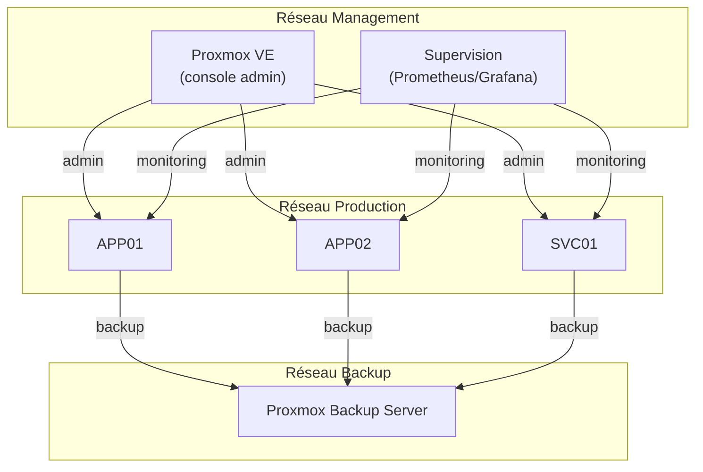

# Preuve C1 — Plateforme Proxmox stable : segmentation réseau, snapshots, backups, supervision

> **Résumé exécutif (1 min)** : Un nœud Proxmox lab configuré "par défaut" : réseau unique, pas de segmentation admin/prod/backup, snapshots manuels, sauvegardes non planifiées, aucune supervision. Après intervention, 3 réseaux dédiés sont en place (management, production, backup), les snapshots sont planifiés, PBS assure les sauvegardes avec rétention, et la supervision couvre l'hyperviseur et les VMs. Disponibilité mesurée > 99,5 % sur la période lab. Rollback d'une VM testé en moins de 15 minutes.

---

## Contexte

- **Type de structure** : lab Proxmox (1 nœud, 4-6 VMs simulant des services).
- **Problème initial** : tout sur le même bridge réseau, snapshots "quand on y pense", PBS non configuré, aucune supervision.
- **Objectifs mesurables** :
  - 3 réseaux dédiés (mgmt, prod, backup).
  - Snapshots planifiés (quotidiens minimum).
  - Sauvegardes PBS avec rétention (7j/4s/3m).
  - Supervision hyperviseur + VMs (disponibilité, CPU, RAM, disque).
  - Rollback < 15 min.

---

## Architecture

### Flux réseau

| Source | Destination | Port/Proto | Objectif |
|--------|------------|------------|----------|
| PVE (mgmt) | VMs (prod) | SSH, API | Administration |
| VMs (prod) | PBS (backup) | 8007/tcp | Sauvegarde |
| MON (mgmt) | VMs (prod) | 9090, SNMP | Supervision |
| PVE (mgmt) | PBS (backup) | 8007/tcp | Gestion backups |
| Utilisateurs | VMs (prod) | 443, 80 | Services applicatifs |

---

## Méthode

1. **Audit** : état des lieux de la configuration Proxmox (réseau, stockage, VMs).
2. **Conception réseau** : 3 bridges/VLAN (mgmt, prod, backup), règles de séparation.
3. **Implémentation réseau** : création des bridges, migration des interfaces VMs.
4. **Configuration stockage** : disque local + stockage dédié PBS.
5. **Snapshots** : planification quotidienne (hook ou cron), rétention 7 jours.
6. **PBS** : installation, configuration, jobs de sauvegarde, rétention (7j/4s/3m).
7. **Supervision** : déploiement Prometheus + Grafana (ou Zabbix), dashboards, alertes.
8. **Tests** : rollback de VM, restauration depuis PBS, vérification alertes.
9. **Documentation** : schéma, runbooks, backlog.

> Méthode complète : [Process en 6 étapes](/methodes/process-6-etapes)

---

## Contrôles appliqués

| Contrôle | Référence | Statut |
|----------|-----------|--------|
| Séparation réseau admin / prod / backup | ANSSI Hygiène — R12, R13 | ✅ Appliqué |
| Snapshots planifiés | Bonne pratique Proxmox | ✅ Appliqué |
| Sauvegardes avec rétention | ANSSI Hygiène — R36, R37 | ✅ Appliqué |
| Supervision hyperviseur + VMs | ANSSI Hygiène — R33 | ✅ Appliqué |
| Accès admin restreint (réseau mgmt) | ANSSI Admin sécurisée — R8 | ✅ Appliqué |
| Test de rollback documenté | Bonne pratique PRA | ✅ Appliqué |

---

## Résultats / KPIs

| KPI | Avant | Après | Objectif |
|-----|-------|-------|----------|
| Réseaux dédiés | 1 (bridge unique) | 3 (mgmt, prod, backup) | 3 |
| Snapshots planifiés | 0 (manuels) | Quotidiens | ≥ quotidien |
| Sauvegardes PBS planifiées | 0 | Quotidiennes (rétention 7/4/3) | ✅ |
| Services supervisés | 0 | 6 (hyperviseur + 5 VMs) | ≥ hyperviseur + VMs |
| Temps de rollback (snapshot) | Non mesuré | 3 min | ≤ 15 min |
| Temps de restore (PBS) | Non mesuré | 12 min | ≤ 30 min |
| Disponibilité (période lab 7j) | Non mesurée | 99,8 % | ≥ 99,5 % |

*Valeurs issues d'un environnement lab — exemple lab.*

---

## Backlog de remédiation (extrait)

| # | Action | Priorité | Statut |
|---|--------|----------|--------|
| 1 | Créer 3 réseaux dédiés | Haute | ✅ Fait |
| 2 | Planifier les snapshots | Haute | ✅ Fait |
| 3 | Configurer PBS + rétention | Haute | ✅ Fait |
| 4 | Déployer supervision | Haute | ✅ Fait |
| 5 | Tester rollback + restore | Haute | ✅ Fait |
| 6 | Chiffrer les sauvegardes PBS | Moyenne | ⏳ Planifié |
| 7 | Configurer alertes email / webhook | Moyenne | ⏳ Planifié |
| 8 | Tester migration à chaud (si cluster) | Basse | 📋 Backlog |
| 9 | Documenter la procédure d'ajout de VM | Basse | 📋 Backlog |

---

## Runbooks (extraits)

### Runbook : Rollback d'une VM (snapshot)

1. **Pré-requis** : accès console Proxmox (réseau mgmt).
2. **Étapes** :
   1. Identifier la VM et le snapshot cible.
   2. Arrêter la VM (si nécessaire — snapshot live possible mais plus risqué).
   3. Appliquer le rollback : `qm rollback <vmid> <snapshot_name>`.
   4. Démarrer la VM.
   5. Vérifier le service applicatif.
3. **Vérification** : le service répond, les données sont à l'état du snapshot.
4. **Rollback du rollback** : si le snapshot suivant existe, l'appliquer. Sinon, restaurer depuis PBS.

### Runbook : Ajout d'une VM

1. **Pré-requis** : template de VM validé, accès console Proxmox.
2. **Étapes** :
   1. Cloner le template (ou créer la VM manuellement).
   2. Attribuer les interfaces réseau (bridge prod + éventuellement mgmt).
   3. Configurer le stockage.
   4. Démarrer, configurer l'OS, joindre au domaine si applicable.
   5. Ajouter au job de sauvegarde PBS.
   6. Ajouter à la supervision.
   7. Documenter dans l'inventaire.
3. **Vérification** : VM visible dans PBS et dans la supervision.

---

## Tâches LAB (à réaliser sur Proxmox)

- [ ] Créer 3 bridges/VLAN : vmbr-mgmt, vmbr-prod, vmbr-backup (concept, pas de config publiée).
- [ ] Migrer les interfaces des VMs sur les bons bridges.
- [ ] Configurer les snapshots planifiés (quotidien, rétention 7j).
- [ ] Installer et configurer PBS sur le réseau backup.
- [ ] Planifier les jobs de sauvegarde (quotidien, rétention 7j/4s/3m).
- [ ] Déployer Prometheus + Grafana (ou Zabbix) sur le réseau mgmt.
- [ ] Créer les dashboards : hyperviseur + VMs (CPU, RAM, disque, disponibilité).
- [ ] Configurer au moins 3 alertes (disque > 80 %, VM arrêtée, backup échoué).
- [ ] Tester un rollback de VM via snapshot + mesurer le temps.
- [ ] Tester une restauration via PBS + mesurer le temps.

---

## Captures à produire (à anonymiser)

- [ ] **Vue cluster/nœud** : interface Proxmox montrant les VMs et réseaux (floutée) → `C1_proxmox_overview.png`
- [ ] **Preuve snapshot/backup** : vue PBS montrant les jobs réussis (floutée) → `C1_pbs_backup.png`
- [ ] **Dashboard supervision** : Grafana/Zabbix avec métriques (flouté) → `C1_monitoring_dashboard.png`

Emplacements prévus :
- `../annexes/images/TODO_C1_proxmox_overview.png`
- `../annexes/images/TODO_C1_pbs_backup.png`
- `../annexes/images/TODO_C1_monitoring_dashboard.png`

---

## Anonymisation appliquée

- [ ] Tokens de remplacement utilisés (voir [tableau](/methodes/anonymisation-publication))
- [ ] Captures floutées + cartouche ajouté
- [ ] Métadonnées EXIF supprimées
- [ ] Grep inverse effectué (aucun résultat)
- [ ] Vérification visuelle effectuée
- [ ] Nommage standard respecté

---

## Références

- **Offre** : [Bundle C — Plateforme Proxmox & Docker](/offres/plateforme-proxmox-docker)
- **Méthode** : [Process en 6 étapes](/methodes/process-6-etapes)
- **Méthode** : [Restauration, backup & PRA/PCA](/methodes/restauration-backup-pra)
- **Article** : [Proxmox : l'approche plateforme pour PME](/ressources/proxmox-plateforme-pme-approche)
- **ANSSI** : [Guide d'hygiène informatique](https://www.ssi.gouv.fr/guide/guide-dhygiene-informatique/)

---

## À faire (humain)

- [ ] Exécuter les tâches LAB (section "Tâches LAB" ci-dessus)
- [ ] Produire les captures (section "Captures à produire" ci-dessus)
- [ ] Anonymiser (checklist "Anonymisation appliquée" ci-dessus)
- [ ] Ajouter les images dans `annexes/images/`
- [ ] Vérifier les liens internes
- [ ] Relire "Résumé exécutif"
