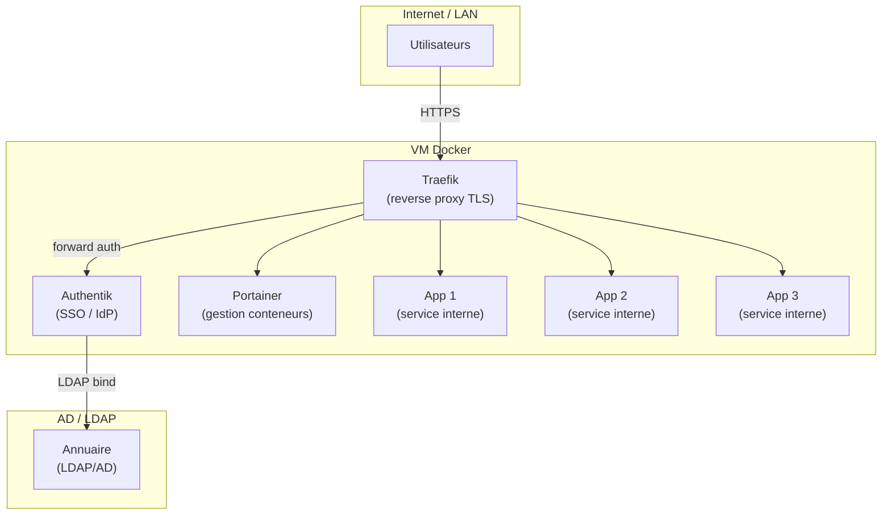
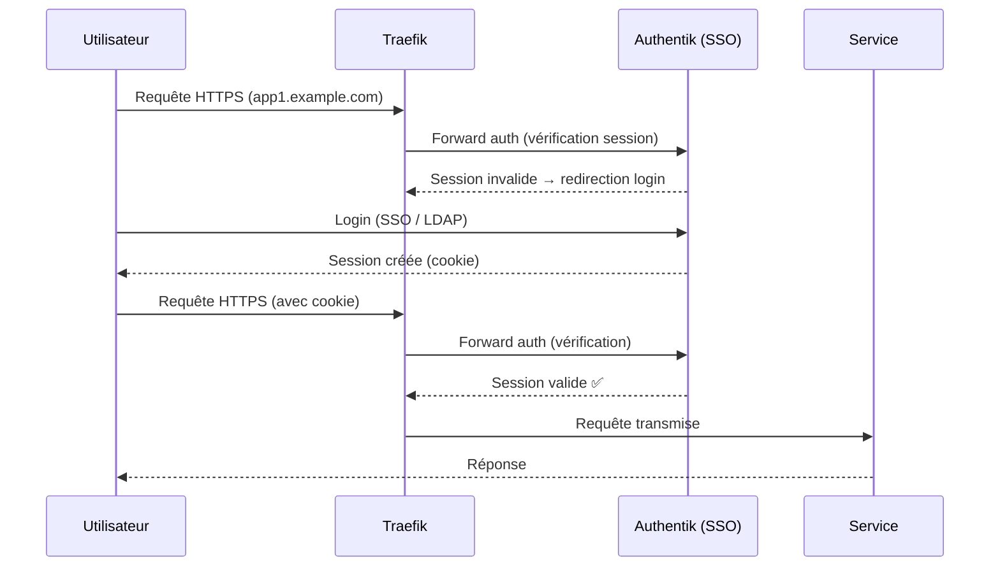

# Preuve C2 — Docker industrialisé : reverse proxy TLS + Portainer + SSO/LDAP + gestion des secrets

> **Résumé exécutif (1 min)** : Un lab Docker "en l'état" : conteneurs lancés manuellement, pas de reverse proxy, accès direct aux ports, aucune authentification centralisée, secrets en clair dans les fichiers Compose. Après intervention, un reverse proxy TLS (Traefik) expose les services de manière sécurisée, Portainer fournit une interface de gestion avec contrôle d'accès, Authentik assure le SSO raccordé au LDAP/AD, les secrets sont gérés via `.env` sécurisés avec rotation documentée. 100 % des services sont derrière SSO + TLS.

---

## Contexte

- **Type de structure** : lab Docker sur Proxmox (VM Linux dédiée, 5-8 conteneurs).
- **Problème initial** : `docker run` manuel, ports exposés en direct, pas de TLS interne, pas d'authentification centralisée, mots de passe en dur dans `docker-compose.yml`.
- **Objectifs mesurables** :
  - 100 % des services exposés via reverse proxy TLS.
  - 100 % des services derrière SSO (authentification centralisée).
  - 0 secret en clair dans les fichiers Compose.
  - Portainer déployé avec contrôle d'accès par rôle.
  - Procédure de rotation des secrets documentée.

---

## Architecture

### Flux d'authentification

---

## Méthode

1. **Audit** : inventaire des conteneurs existants, ports exposés, secrets en clair.
2. **Structuration Compose** : réorganisation en fichiers Compose propres (un par stack).
3. **Reverse proxy** : déploiement Traefik avec certificats TLS (Let's Encrypt ou interne).
4. **Portainer** : déploiement, configuration des teams et rôles.
5. **SSO** : déploiement Authentik, configuration des providers (LDAP, OIDC).
6. **Forward auth** : configuration Traefik → Authentik pour chaque service.
7. **Secrets** : migration des secrets vers fichiers `.env` sécurisés (permissions restrictives).
8. **Documentation** : architecture, procédures d'ajout de service, rotation secrets.
9. **Tests** : accès sans SSO → refusé, accès avec SSO → autorisé, rotation secret → vérifié.

> Méthode complète : [[methodes/process-6-etapes|Process en 6 étapes]]

---

## Guide d'exploitation

### Ajouter un nouveau service

1. Créer le fichier Compose dans le répertoire dédié.
2. Définir les labels Traefik pour le routage (host, TLS, middleware auth).
3. Créer le provider Authentik pour le service (application + outpost).
4. Ajouter les secrets dans le fichier `.env` (pas dans le Compose).
5. `docker compose up -d` + vérifier dans Portainer.
6. Tester : accès sans SSO refusé, accès avec SSO autorisé.
7. Documenter dans l'inventaire des services.

### Rotation des secrets

1. Identifier le secret à faire pivoter (`.env`).
2. Générer un nouveau secret (32+ caractères, aléatoire).
3. Mettre à jour le fichier `.env`.
4. Redémarrer le service concerné (`docker compose restart <service>`).
5. Vérifier le fonctionnement.
6. Journaliser la rotation (date, service, opérateur).

### Mise à jour d'un service

1. Vérifier les release notes de l'image (breaking changes).
2. Tirer la nouvelle image : `docker compose pull <service>`.
3. Snapshot/backup de la VM Docker (avant mise à jour).
4. Appliquer : `docker compose up -d <service>`.
5. Vérifier le fonctionnement.
6. Rollback si problème : `docker compose down <service>` + image précédente.

---

## Contrôles appliqués

| Contrôle | Référence | Statut |
|----------|-----------|--------|
| TLS sur tous les services exposés | ANSSI Hygiène — R20 | ✅ Appliqué |
| Authentification centralisée (SSO) | ANSSI Admin sécurisée — R7 | ✅ Appliqué |
| Secrets séparés du code / config | ANSSI Hygiène — R22 | ✅ Appliqué |
| Contrôle d'accès par rôle (Portainer) | Bonne pratique Docker | ✅ Appliqué |
| Journalisation des accès | CNIL — Journalisation | ✅ Activé |
| Pas de conteneur en mode `--privileged` | CIS Docker Benchmark | ✅ Vérifié |

---

## Résultats / KPIs

| KPI | Avant | Après | Objectif |
|-----|-------|-------|----------|
| Services derrière reverse proxy TLS | 0 / 5 | 5 / 5 | 100 % |
| Services derrière SSO | 0 / 5 | 5 / 5 | 100 % |
| Secrets en clair dans Compose | 8 | 0 | 0 |
| Portainer avec RBAC | Non | Oui | ✅ |
| Procédure rotation secrets documentée | Non | Oui | ✅ |
| Procédure ajout service documentée | Non | Oui | ✅ |

*Valeurs issues d'un environnement lab — exemple lab.*

---

## Backlog de remédiation (extrait)

| # | Action | Priorité | Statut |
|---|--------|----------|--------|
| 1 | Déployer Traefik + TLS | Haute | ✅ Fait |
| 2 | Déployer Authentik + raccorder LDAP | Haute | ✅ Fait |
| 3 | Configurer forward auth pour tous les services | Haute | ✅ Fait |
| 4 | Déployer Portainer + configurer RBAC | Haute | ✅ Fait |
| 5 | Migrer les secrets vers `.env` | Haute | ✅ Fait |
| 6 | Documenter les procédures d'exploitation | Haute | ✅ Fait |
| 7 | Automatiser les mises à jour (Watchtower ou équivalent) | Moyenne | ⏳ Planifié |
| 8 | Hardening conteneurs (read-only, capabilities drop) | Moyenne | 📋 Backlog |
| 9 | Backup des volumes Docker | Moyenne | 📋 Backlog |

---

## Tâches LAB (à réaliser sur VM Linux / Proxmox)

- [ ] Installer Docker + Docker Compose sur une VM Linux dédiée.
- [ ] Déployer Traefik (reverse proxy) — décrire la logique, ne pas coller la config.
- [ ] Configurer les certificats TLS (Let's Encrypt ou auto-signé pour le lab).
- [ ] Déployer Portainer, configurer les teams/rôles.
- [ ] Déployer Authentik (ou Keycloak) — décrire le choix et la raison.
- [ ] Raccorder Authentik à LDAP/AD du lab (Preuve B1 si disponible).
- [ ] Configurer le forward auth Traefik → Authentik pour 3+ services.
- [ ] Déployer 3-5 services internes (ex : wiki, monitoring, gestion de projet).
- [ ] Migrer tous les secrets vers fichiers `.env` (permissions 600).
- [ ] Tester : accès sans SSO refusé, avec SSO autorisé, rotation de secret.

---

## Captures à produire (à anonymiser)

- [ ] **Page Portainer** : vue des stacks/conteneurs (floutée) → `C2_portainer.png`
- [ ] **Page SSO** : page de login Authentik (floutée) → `C2_sso_login.png`
- [ ] **Schéma d'authentification** : reconstitué ou capture flux (flouté) → `C2_auth_flow.png`

Emplacements prévus :
- `../annexes/images/TODO_C2_portainer.png`
- `../annexes/images/TODO_C2_sso_login.png`
- `../annexes/images/TODO_C2_auth_flow.png`

---

## Anonymisation appliquée

- [ ] Tokens de remplacement utilisés (voir [[methodes/anonymisation-publication|tableau]])
- [ ] Captures floutées + cartouche ajouté
- [ ] Métadonnées EXIF supprimées
- [ ] Grep inverse effectué (aucun résultat)
- [ ] Vérification visuelle effectuée
- [ ] Nommage standard respecté

---

## Références

- **Offre** : [[offres/plateforme-proxmox-docker|Bundle C — Plateforme Proxmox & Docker]]
- **Méthode** : [[methodes/process-6-etapes|Process en 6 étapes]]
- **Article** : [[ressources/docker-en-prod-les-7-regles|Docker en production : les 7 règles]]
- **ANSSI** : [Guide d'hygiène informatique](https://www.ssi.gouv.fr/guide/guide-dhygiene-informatique/)
- **CIS** : [Docker Benchmark](https://www.cisecurity.org/benchmark/docker)

---

## À faire (humain)

- [ ] Exécuter les tâches LAB (section "Tâches LAB" ci-dessus)
- [ ] Produire les captures (section "Captures à produire" ci-dessus)
- [ ] Anonymiser (checklist "Anonymisation appliquée" ci-dessus)
- [ ] Ajouter les images dans `annexes/images/`
- [ ] Vérifier les liens internes
- [ ] Relire "Résumé exécutif"
