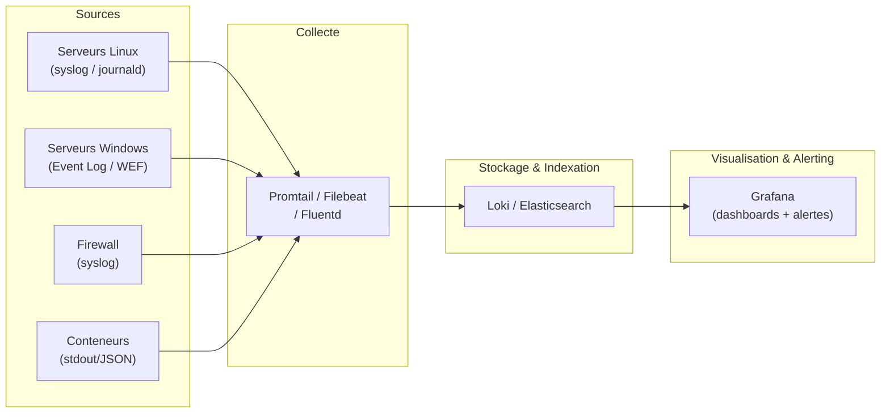

# Preuve T1 — Journalisation & alerting minimal viable (SIEM-lite)

> **Résumé exécutif (1 min)** : Un environnement lab sans centralisation de logs, sans dashboards, sans alertes. Après déploiement d'un pipeline de collecte (syslog + journald + Event Log Windows), d'un stack de visualisation (Grafana/Loki ou équivalent) et de règles d'alerte, le temps de détection d'un événement anormal passe de "jamais détecté" à moins de 15 minutes. Un runbook d'investigation accompagne chaque type d'alerte. Le principe de minimisation (CNIL) est respecté : seuls les logs justifiés sont collectés.

---

## Contexte

- **Type de structure** : lab multi-OS (Linux + Windows, lab Proxmox existant).
- **Problème initial** : logs locaux uniquement, pas de centralisation, pas de dashboards, pas d'alertes. Un incident passe inaperçu jusqu'à ce qu'un utilisateur signale un problème.
- **Objectifs mesurables** :
  - Centraliser les logs de 100 % des services critiques.
  - Créer 5+ dashboards exploitables.
  - Configurer 10+ règles d'alerte (sécurité + exploitation).
  - Temps de détection d'un événement anormal < 15 min.
  - Runbook d'investigation pour chaque catégorie d'alerte.

---

## Architecture

---

## Pipeline de collecte

| Source | Transport | Format | Rétention |
|--------|-----------|--------|-----------|
| Linux (syslog) | rsyslog → Promtail | JSON structuré | 6 mois |
| Windows (Event Log) | WEF / Winlogbeat | JSON | 6 mois |
| Firewall | syslog UDP/TCP | CEF/syslog | 3 mois |
| Docker | stdout → Loki driver | JSON | 3 mois |

---

## Dashboards créés

| Dashboard | Contenu | Usage |
|-----------|---------|-------|
| **Santé système** | CPU, RAM, disque, uptime par serveur | Exploitation quotidienne |
| **Authentifications** | Succès/échecs, sources, top users | Sécurité |
| **Firewall** | Connexions autorisées/bloquées, top destinations | Sécurité réseau |
| **Logs applicatifs** | Erreurs, warnings, tendances | Debug applicatif |
| **Alertes actives** | Alertes en cours, historique, acquittements | Pilotage |

---

## Règles d'alerte (extrait)

| Alerte | Condition | Sévérité | Runbook |
|--------|-----------|----------|---------|
| Échecs d'authentification répétés | > 10 échecs en 5 min (même source) | Haute | Runbook AUTH-01 |
| Élévation de privilèges | Événement 4672 (Windows) / sudo (Linux) | Haute | Runbook PRIV-01 |
| Service arrêté | Pas de heartbeat depuis 5 min | Haute | Runbook SVC-01 |
| Disque > 85 % | Seuil espace disque | Moyenne | Runbook DISK-01 |
| Backup échoué | Absence de log backup dans les 24 h | Haute | Runbook BKP-01 |
| Connexion sortante inhabituelle | Destination non whitelistée | Moyenne | Runbook NET-01 |
| Modification GPO | Événement 5136 | Haute | Runbook GPO-01 |
| Création de compte | Événement 4720 | Moyenne | Runbook ACCT-01 |
| Redémarrage serveur | Événement système reboot | Basse | Runbook REBOOT-01 |
| Certificat TLS expirant | Expiration < 15 jours | Moyenne | Runbook CERT-01 |

---

## Runbooks d'investigation (extrait)

### Runbook AUTH-01 : Échecs d'authentification répétés

1. **Contexte** : l'alerte signale > 10 échecs en 5 min depuis une même source.
2. **Investigation** :
   1. Identifier la source (IP, hostname, compte ciblé).
   2. Vérifier si la source est légitime (poste utilisateur, script, service).
   3. Vérifier si le compte ciblé existe.
   4. Consulter les logs détaillés (type d'échec : mot de passe incorrect, compte verrouillé, etc.).
3. **Décision** :
   - Source légitime + erreur utilisateur → contacter l'utilisateur, réinitialiser le mot de passe si nécessaire.
   - Source inconnue / suspecte → bloquer l'IP au firewall, vérifier l'intégrité du poste source, escalader.
4. **Documentation** : consigner l'incident (date, source, action, résolution).

### Runbook SVC-01 : Service arrêté

1. **Contexte** : pas de heartbeat depuis 5 min pour un service critique.
2. **Investigation** :
   1. Vérifier l'état du service (`systemctl status`, `docker ps`).
   2. Consulter les logs du service (dernières entrées).
   3. Vérifier les ressources (CPU, RAM, disque).
3. **Action** :
   - Cause identifiée (OOM, disque plein, crash) → corriger + redémarrer.
   - Cause non identifiée → redémarrer en observant les logs, escalader si récurrence.
4. **Documentation** : consigner l'incident.

---

## Contrôles appliqués

| Contrôle | Référence | Statut |
|----------|-----------|--------|
| Centralisation des logs | ANSSI Hygiène — R33, R34 | ✅ Appliqué |
| Minimisation (CNIL) : seuls les logs justifiés sont collectés | CNIL — Journalisation | ✅ Appliqué |
| Séparation des rôles (admins ne modifient pas leurs logs) | ANSSI Admin sécurisée | ✅ Appliqué |
| Alerting sur événements critiques | ANSSI Hygiène — R34 | ✅ Appliqué |
| Runbooks d'investigation | Bonne pratique SOC/NOC | ✅ Documenté |
| Rétention définie par catégorie | CNIL — Durée de conservation | ✅ Appliqué |

---

## Résultats / KPIs

| KPI | Avant | Après | Objectif |
|-----|-------|-------|----------|
| Sources centralisées | 0 | 100 % services critiques | 100 % |
| Dashboards exploitables | 0 | 5 | ≥ 5 |
| Règles d'alerte actives | 0 | 10 | ≥ 10 |
| Temps de détection (événement anormal) | ∞ (jamais détecté) | < 15 min | ≤ 15 min |
| Runbooks d'investigation | 0 | 10 (1 par type d'alerte) | ≥ 1 par alerte |

*Valeurs issues d'un environnement lab — exemple lab.*

---

## Backlog de remédiation (extrait)

| # | Action | Priorité | Statut |
|---|--------|----------|--------|
| 1 | Déployer le pipeline de collecte | Haute | ✅ Fait |
| 2 | Créer les dashboards | Haute | ✅ Fait |
| 3 | Configurer les alertes | Haute | ✅ Fait |
| 4 | Rédiger les runbooks d'investigation | Haute | ✅ Fait |
| 5 | Intégrer les logs Windows (WEF/Winlogbeat) | Moyenne | ⏳ Planifié |
| 6 | Ajouter des alertes de corrélation (multi-sources) | Moyenne | 📋 Backlog |
| 7 | Automatiser les réponses (webhook → script) | Basse | 📋 Backlog |

---

## Tâches LAB

- [ ] Déployer Loki + Grafana (ou ELK) sur le lab.
- [ ] Configurer la collecte depuis les serveurs Linux (Promtail / rsyslog).
- [ ] Configurer la collecte depuis les serveurs Windows (Winlogbeat / WEF).
- [ ] Configurer la collecte depuis le firewall lab (syslog).
- [ ] Créer les 5 dashboards listés ci-dessus.
- [ ] Configurer les 10 règles d'alerte.
- [ ] Simuler un événement anormal (ex : brute-force SSH) et vérifier la détection < 15 min.
- [ ] Dérouler le runbook d'investigation et documenter le résultat.

---

## Captures à produire (à anonymiser)

- [ ] **Dashboard Grafana** : vue d'ensemble (flouté) → `T1_grafana_dashboard.png`
- [ ] **Exemple d'alerte** : alerte déclenchée + notification (flouté) → `T1_alert_example.png`

Emplacements prévus :
- `../annexes/images/TODO_T1_grafana_dashboard.png`
- `../annexes/images/TODO_T1_alert_example.png`

---

## Anonymisation appliquée

- [ ] Tokens de remplacement utilisés (voir [[content/methodes/anonymisation-publication|tableau]])
- [ ] Captures floutées + cartouche ajouté
- [ ] Métadonnées EXIF supprimées
- [ ] Grep inverse effectué (aucun résultat)
- [ ] Vérification visuelle effectuée
- [ ] Nommage standard respecté

---

## Références

- **Offre** : [[content/offres/options|Options — Observabilité / SIEM-lite]]
- **Méthode** : [[content/methodes/journalisation-et-conformite|Journalisation & conformité]]
- **Méthode** : [[content/methodes/process-6-etapes|Process en 6 étapes]]
- **Article** : [[content/ressources/journalisation-utile-sans-surveiller|Journalisation utile sans surveiller]]
- **CNIL** : [Recommandation relative à la journalisation](https://www.cnil.fr/fr/la-cnil-publie-une-recommandation-relative-a-la-journalisation)
- **ANSSI** : [Guide d'hygiène informatique](https://www.ssi.gouv.fr/guide/guide-dhygiene-informatique/)

---

## À faire (humain)

- [ ] Exécuter les tâches LAB (section "Tâches LAB" ci-dessus)
- [ ] Produire les captures (section "Captures à produire" ci-dessus)
- [ ] Anonymiser (checklist "Anonymisation appliquée" ci-dessus)
- [ ] Ajouter les images dans `annexes/images/`
- [ ] Vérifier les liens internes
- [ ] Relire "Résumé exécutif"
