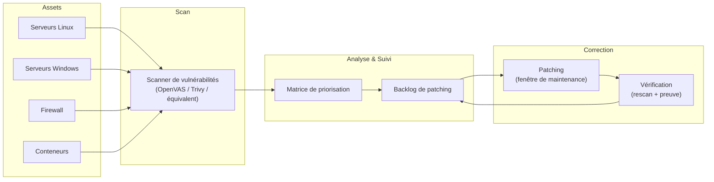

# Preuve T2 — Vulnerability management + patch management

> **Résumé exécutif (1 min)** : Un lab multi-OS sans processus de gestion des vulnérabilités : pas de scan régulier, pas de priorisation, pas de SLA de correction, pas de preuve de patching. Après mise en place, un scan hebdomadaire identifie les vulnérabilités, une matrice de priorisation classe chaque faille (criticité × exposition × exploitabilité), des SLA internes définissent les délais de correction, et un backlog de patching est suivi. Résultat lab : 100 % des vulnérabilités critiques corrigées en < 72 h, backlog visible et priorisé.

---

## Contexte

- **Type de structure** : lab multi-OS (Linux + Windows, lab Proxmox existant).
- **Problème initial** : aucun scan de vulnérabilités, mises à jour "quand on y pense", aucune visibilité sur l'exposition, pas de SLA.
- **Objectifs mesurables** :
  - Scan de vulnérabilités hebdomadaire sur 100 % des assets.
  - Matrice de priorisation opérationnelle.
  - SLA : critique < 72 h, haute < 7 j, moyenne < 30 j.
  - Backlog de patching suivi et documenté.
  - Preuve de patch appliqué pour chaque correctif.

---

## Architecture

---

## Matrice de priorisation

Chaque vulnérabilité est classée selon 3 axes :

| Axe | Faible (1) | Moyen (2) | Élevé (3) |
|-----|-----------|-----------|-----------|
| **Criticité (CVSS)** | < 4.0 | 4.0 — 7.9 | ≥ 8.0 |
| **Exposition** | Réseau interne, service non critique | Réseau interne, service critique | Exposé sur internet |
| **Exploitabilité** | Pas de PoC connu | PoC public | Exploitation active connue |

**Score = Criticité × Exposition × Exploitabilité**

| Score | Priorité | SLA correction |
|-------|----------|---------------|
| ≥ 18 | **Critique** | < 72 h |
| 9 — 17 | **Haute** | < 7 jours |
| 4 — 8 | **Moyenne** | < 30 jours |
| 1 — 3 | **Basse** | Prochain cycle de maintenance |

---

## SLA internes

| Priorité | Délai de correction | Validation |
|----------|-------------------|------------|
| Critique | < 72 h | Rescan + preuve de patch |
| Haute | < 7 jours | Rescan + preuve de patch |
| Moyenne | < 30 jours | Rescan lors du prochain cycle |
| Basse | Prochain cycle trimestriel | Suivi backlog |

---

## Backlog de patching (extrait — données lab anonymisées)

| # | Asset | Vulnérabilité | CVSS | Exposition | Exploitabilité | Score | Priorité | Statut | Date correction |
|---|-------|--------------|------|-----------|----------------|-------|----------|--------|----------------|
| 1 | APP01 (Linux) | CVE-XXXX-YYYY (noyau) | 8.1 | Interne, critique | PoC public | 18 | Critique | ✅ Corrigé | J+2 |
| 2 | DC01 (Windows) | CVE-XXXX-ZZZZ (SMB) | 9.8 | Interne, critique | Exploit actif | 27 | Critique | ✅ Corrigé | J+1 |
| 3 | APP02 (Linux) | CVE-XXXX-AAAA (OpenSSL) | 7.5 | Interne, non critique | PoC public | 12 | Haute | ✅ Corrigé | J+5 |
| 4 | FW01 | CVE-XXXX-BBBB (firmware) | 6.5 | Exposé | Pas de PoC | 6 | Moyenne | ⏳ Planifié | - |
| 5 | DOCKER (image) | CVE-XXXX-CCCC (lib) | 4.0 | Interne | Pas de PoC | 2 | Basse | 📋 Backlog | - |

*Identifiants CVE fictifs — environnement lab. Les vrais CVE sont identifiés au scan mais non publiés ici.*

---

## Méthode

1. **Inventaire** : lister tous les assets (OS, services, versions).
2. **Scan initial** : exécuter le scanner sur tous les assets.
3. **Priorisation** : appliquer la matrice (criticité × exposition × exploitabilité).
4. **Plan de correction** : planifier les patchs par priorité et fenêtre de maintenance.
5. **Correction** : appliquer les patchs, snapshot avant si possible.
6. **Vérification** : rescan pour confirmer la correction. Preuve archivée.
7. **Boucle** : scan hebdomadaire, mise à jour du backlog.

> Méthode complète : [[methodes/process-6-etapes|Process en 6 étapes]]

---

## Contrôles appliqués

| Contrôle | Référence | Statut |
|----------|-----------|--------|
| Scan de vulnérabilités régulier | ANSSI Hygiène — R38 | ✅ Appliqué |
| Priorisation des correctifs | ANSSI Hygiène — R39 | ✅ Appliqué |
| SLA de correction définis | Bonne pratique vuln management | ✅ Appliqué |
| Preuve de patch (rescan) | Bonne pratique audit | ✅ Appliqué |
| Backlog suivi et documenté | Bonne pratique gestion de projet | ✅ Appliqué |

---

## Résultats / KPIs

| KPI | Avant | Après | Objectif |
|-----|-------|-------|----------|
| Fréquence de scan | 0 | Hebdomadaire | Hebdomadaire |
| Vulnérabilités critiques ouvertes | Inconnu | 0 (corrigées < 72 h) | 0 |
| Délai moyen correction (critique) | ∞ | 1,5 j (lab) | ≤ 3 j |
| Backlog suivi | Non | Oui | ✅ |
| Preuve de patch archivée | Non | Oui | ✅ |

*Valeurs issues d'un environnement lab — exemple lab.*

---

## Runbooks (extraits)

### Runbook : Correction d'une vulnérabilité critique

1. **Pré-requis** : accès admin à l'asset, snapshot/backup récent.
2. **Étapes** :
   1. Vérifier la disponibilité du correctif (éditeur, dépôt).
   2. Prendre un snapshot de la VM (rollback si problème).
   3. Appliquer le correctif (apt/yum/Windows Update/firmware).
   4. Redémarrer si nécessaire.
   5. Vérifier le fonctionnement du service.
   6. Lancer un rescan ciblé pour confirmer la correction.
   7. Archiver la preuve (rapport de scan avant/après).
3. **Rollback** : si le patch casse le service, restaurer le snapshot.
4. **Documentation** : mettre à jour le backlog (statut, date, opérateur).

---

## Tâches LAB

- [ ] Installer un scanner de vulnérabilités (OpenVAS, Trivy pour Docker, ou équivalent).
- [ ] Scanner tous les assets du lab (Linux, Windows, firewall, conteneurs).
- [ ] Appliquer la matrice de priorisation sur les résultats.
- [ ] Corriger au moins 3 vulnérabilités (1 critique, 1 haute, 1 moyenne).
- [ ] Rescanner pour confirmer les corrections.
- [ ] Remplir le backlog de patching.

---

## Captures à produire (à anonymiser)

- [ ] **Backlog de patching** : tableau rempli (anonymisé) → `T2_backlog.png`
- [ ] **Preuve de patch** : rapport de scan avant/après (flouté) → `T2_patch_proof.png`

Emplacements prévus :
- `../annexes/images/TODO_T2_backlog.png`
- `../annexes/images/TODO_T2_patch_proof.png`

---

## Anonymisation appliquée

- [ ] Tokens de remplacement utilisés (voir [[methodes/anonymisation-publication|tableau]])
- [ ] Captures floutées + cartouche ajouté
- [ ] Métadonnées EXIF supprimées
- [ ] Grep inverse effectué (aucun résultat)
- [ ] Vérification visuelle effectuée
- [ ] Nommage standard respecté

---

## Références

- **Offre** : [[offres/options|Options — Vuln management & patch cadence]]
- **Méthode** : [[methodes/process-6-etapes|Process en 6 étapes]]
- **ANSSI** : [Guide d'hygiène informatique](https://www.ssi.gouv.fr/guide/guide-dhygiene-informatique/)

---

## À faire (humain)

- [ ] Exécuter les tâches LAB (section "Tâches LAB" ci-dessus)
- [ ] Produire les captures (section "Captures à produire" ci-dessus)
- [ ] Anonymiser (checklist "Anonymisation appliquée" ci-dessus)
- [ ] Ajouter les images dans `annexes/images/`
- [ ] Vérifier les liens internes
- [ ] Relire "Résumé exécutif"
